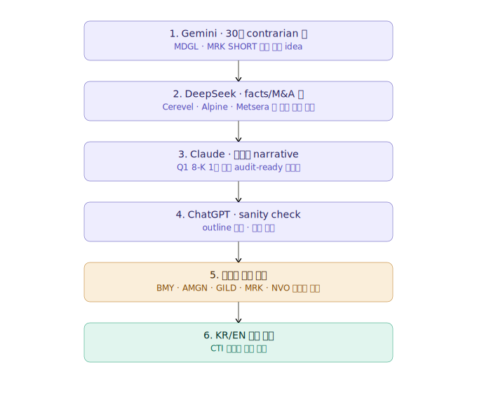

# Pharma Sector Long/Short Prompt — 4-LLM × 2-Language Cross-Validation

**비교 대상 모델:** ChatGPT · Claude · DeepSeek · Gemini
**비교 대상 언어:** 한국어 (KR) · 중국어 (CN)
**프롬프트 일자:** 2026-05-04
**프롬프트 종류:** 미국 제약 섹터 Long/Short 포트폴리오 (12–24개월 horizon)
**비교 방법:** 동일 프롬프트, 동일 시점, 동일 페르소나, **언어만 변경** — 출력물의 정성·정량 비교

---

## Executive Summary (TL;DR)

### 가장 충격적인 발견 — 같은 LLM이 언어에 따라 정반대 포지션을 출력한다

| LLM | 종목 | 한국어 출력 | 중국어 출력 |
|-----|------|------------|------------|
| **DeepSeek** | **AMGN** | **SHORT** | **LONG #4** |
| **DeepSeek** | **JNJ** | **LONG #5** | **SHORT** |
| **Claude** | **BMY** | **LONG #4** | **SHORT** |
| **Claude** | **ABBV** | **LONG #3** | 미언급 |
| **Claude** | **GILD** | **LONG #6** | 미언급 |
| **Gemini** | **MRK** | **SHORT (단독)** | **LONG #3 ($155 목표)** |

→ **단일 LLM × 단일 언어 의존은 사실상 "언어별 룰렛 게임"입니다.** 4개 LLM × 2개 언어 = 최대 8개의 서로 다른 포트폴리오가 산출됩니다.

### 분량/구조 — KR/CN 모두 모델별로 다름

| 모델 | KR 분량 | CN 분량 | 변화 |
|------|---------|---------|------|
| **Gemini** | 4.13 KB | 3.6 KB | 압축 유지 |
| **DeepSeek** | 38.6 KB (영어) | **4.64 KB** | **8배 압축** (영어 institutional → 중국어 outline) |
| **ChatGPT** | 5.16 KB | (CN 미발행) | — |
| **Claude** | 28.5 KB | **37.9 KB** | **35% 증가** (CN이 더 상세함) |

**특이점**: Claude만 CN 출력이 KR보다 길어졌습니다 — DeepSeek과 정반대 패턴입니다.

### DeepSeek의 특이성 (데니스 직접 코멘트 인용)

> DeepSeek의 모회사는 HFT 회사이고 중국의 헤지펀드입니다. 딥씨크가 출력한 금융 리포트는 상당히 전문적인 데이터 양식으로 일반적으로 미국의 유료 금융 리포트 양식으로 보입니다. 모회사의 특성상 금융 도메인에 대한 이해도가 높기 때문에 리포트 양식 및 분석이 더 뛰어날 수도 있다고 추정하고 있습니다.
>
> 中国人常说一句很有意思的话："上有政策，下有对策"。这句话放在这里也颇为贴切。至于是否像"山寨"一样的方式去获取数据用于训练，其实仍然值得打一个问号。另一方面，DeepSeek 的母公司本身就是一家专注于高频交易（HFT）的对冲基金，这意味着它很可能本就拥有相当丰富且高质量的数据资源。

흥미롭게도, DeepSeek는 **한국어 프롬프트엔 영어로**, **중국어 프롬프트엔 중국어로** 응답했습니다. 이는 모회사가 중국 HFT 회사라는 사실과 일치하는 도메인-언어 정렬 패턴입니다.

### 양극화 종목 5개 (KR 4-LLM 기준 — CN까지 확장하면 더 늘어남)

| 종목 | ChatGPT | Claude | DeepSeek | Gemini |
|------|---------|--------|----------|--------|
| **BMY** | SHORT | **LONG (KR) / SHORT (CN)** | SHORT | SHORT |
| **AMGN** | LONG | 미언급 | **SHORT (KR) / LONG (CN)** | LONG |
| **GILD** | SHORT | **LONG (KR) / 미언급 (CN)** | 미언급 | 미언급 |
| **NVO** | LONG #2 | 사실상 부정 | LONG #7 | LONG |
| **MRK** | LONG #3 | 미언급 | LONG #6 (KR) / **LONG (CN)** | **SHORT (KR) / LONG (CN)** |

→ **MRK는 단일 LLM(Gemini)이 KR/CN에서 정반대 포지션을 출력한 가장 극명한 사례**입니다.

### 단독 발굴 종목 (KR과 CN 합쳐서)

| 종목 | 발굴 모델 / 언어 | 이유 |
|------|----------------|------|
| **ARGX** | Claude (KR + CN 공통) | VYVGART 라벨 확장 PDUFA 5/10/2026 |
| **AZN, JNJ** | DeepSeek (KR 단독) | 다중 Phase 3 readout density |
| **MDGL** | Gemini (KR), Claude (CN) | Rezdiffra MASH first-in-class |
| **INSM** | **Claude CN 단독** | Brinsupri DPP1 inhibitor first-in-class |
| **ALNY** | **Claude CN 단독** | Amvuttra ATTR-CM 시장 확대 |
| **ASND** | **Gemini CN 단독** | TransCon 기술, 희귀병 시장 |
| **BIIB SHORT** | **Gemini CN 단독** | 알츠하이머 상업화 실패 |
| **MRK SHORT** | Gemini KR 단독 | Keytruda 2028 LOE + IRA |

### DeepSeek 영어 출력 문제 (KR 프롬프트 한정)

DeepSeek은 한국어 프롬프트엔 영어로 응답했지만, 중국어 프롬프트엔 정확한 중국어로 응답했습니다. 이는 **모델의 언어 지원이 코퍼스 비중에 비례**한다는 강한 증거입니다. 6가지 메커니즘:

1. **훈련 데이터 편향**: 중국+영어 코퍼스 주력, 한국어 instruction-following 약함
2. **명시적 언어 강제 부재**: 프롬프트에 "한국어로"라는 지정 없음
3. **도메인 활성화 효과**: "S&P 500/PDUFA/FDA" 등 영문 약어 70+ 등장
4. **Reasoning Mode 특성**: DeepSeek-R1/V3는 사고 과정 자체가 영어
5. **Token 효율 학습**: 한·영 혼합보다 영어 통일이 토큰 효율적
6. **페르소나 효과**: "Senior Healthcare Portfolio Manager"가 영문 도메인 트리거

> **해결법**: 프롬프트 끝에 **"모든 출력은 반드시 한국어로 작성"** 명시 한 줄.

### 데니스의 4-LLM × 2-Language 워크플로우

이미 multi-LLM cross-validation을 하고 계신 점은 **best practice**이며, **CN 발행을 추가한 것은 한 단계 더 진화한 패턴**입니다. CTI 리포트의 KR/EN/CN/JP 4개국어 발행 노하우와 정확히 같은 패턴입니다.

> **특이점**: ChatGPT와 Gemini는 모두 stale data 흔적이 명확합니다. Web search 활용은 Claude/DeepSeek만 적극적입니다.

---

## 비교 대상 파일

### 한국어 (KR) 출력

| 모델 | 파일 크기 | 라인 수 | 출력 언어 | 비고 |
|------|----------|---------|----------|------|
| **Gemini** | 4.13 KB | 73 lines | 한국어 | 가장 짧음 |
| **ChatGPT** | 5.16 KB | 240 lines | 한국어 + 영어 혼용 | outline |
| **Claude** | 28.5 KB | 492 lines | 한국어 | 풀리포트 |
| **DeepSeek** | 38.6 KB | 555 lines | **영어 (전체)** | 영어 institutional |

### 중국어 (CN) 출력

| 모델 | 파일 크기 | 라인 수 | 출력 언어 | 비고 |
|------|----------|---------|----------|------|
| **Gemini** | 3.6 KB | 224 lines | 중국어 | 가장 짧음 |
| **DeepSeek** | 4.64 KB | 247 lines | 중국어 | **영어 → 중국어 전환 + 8배 압축** |
| **Claude** | **37.9 KB** | 792 lines | 중국어 + 한국어 혼용 | **CN 출력 중 가장 긺 (KR보다 +35%)** |
| **ChatGPT** | (미발행) | — | — | — |

**관찰**: Claude의 KR/CN 분량이 정반대 패턴 (KR 28KB → CN 38KB), DeepSeek은 정반대 (KR 38KB 영어 → CN 4.6KB 중국어 압축)입니다. 같은 모델이라도 언어에 따라 출력 양식이 근본적으로 달라집니다.

---

## 종목 선정 — KR vs CN 차이 (모델별)

### Claude — KR vs CN

**가장 큰 변화를 보인 모델**입니다. KR과 CN의 LONG 7개 중 **4개만 겹침** (LLY/VRTX/ARGX/REGN).

| 티커 | KR Claude | CN Claude | 변화 |
|------|-----------|-----------|------|
| **LLY** | LONG #1 (85) | LONG #1 (85) | 동일 |
| **VRTX** | LONG #2 (86) | LONG #2 (85) | 동일 |
| **ARGX** | LONG #7 (79) | LONG #3 (83) | **CN에서 순위 상승** |
| **REGN** | LONG #5 (80) | LONG #4 (84) | 동일 LONG |
| **ABBV** | LONG #3 (86) | **미언급** | **KR LONG → CN 제외** |
| **BMY** | **LONG #4 (83)** | **SHORT #3 (74)** | **정반대 이동** |
| **GILD** | LONG #6 (82) | **미언급** | **KR LONG → CN 제외** |
| **MDGL** | 미언급 | LONG #5 (78) | **CN에서 신규 발굴** |
| **INSM** | 미언급 | LONG #6 (74) | **CN에서 신규 발굴** |
| **ALNY** | 미언급 | LONG #7 (76) | **CN에서 신규 발굴** |

→ **Claude의 CN 버전은 KR보다 더 미드캡/희귀병 위주의 다각화된 포트폴리오**를 산출했습니다. ABBV·BMY·GILD 같은 메가캡을 빼고, MDGL·INSM·ALNY 같은 specialty pharma를 추가했습니다.

### DeepSeek — KR vs CN

| 티커 | KR DeepSeek (영어) | CN DeepSeek (중국어) | 변화 |
|------|-------------------|---------------------|------|
| **LLY** | LONG #1 (89) | LONG #1 (89) | 동일 |
| **ABBV** | LONG #2 (88) | LONG #2 (87) | 동일 |
| **AZN** | LONG #3 (86) | LONG #3 (83) | 동일 |
| **AMGN** | **SHORT #1 (85)** | **LONG #4 (80)** | **정반대 이동** |
| **MRK** | LONG #6 (80) | LONG #5 (78) | 동일 |
| **VRTX** | LONG #4 (83) | LONG #6 (77) | 동일 LONG |
| **JNJ** | LONG #5 (81) | **SHORT #3 (75)** | **정반대 이동** |
| **GILD** | 미언급 | LONG #7 (76) | **CN 신규** |
| **PFE** | SHORT #2 (79) | SHORT #1 (90) | SHORT 강화 |
| **BMY** | SHORT #3 (76) | SHORT #2 (84) | SHORT 강화 |

→ **DeepSeek의 CN 버전은 SHORT 풀이 PFE/BMY/JNJ로 변경** (KR은 PFE/BMY/AMGN). AMGN은 KR SHORT → CN LONG, JNJ는 KR LONG → CN SHORT로 **두 종목이 정확히 자리 교환**되었습니다.

### Gemini — KR vs CN

| 티커 | KR Gemini | CN Gemini | 변화 |
|------|-----------|-----------|------|
| **LLY** | LONG #1 (95) | LONG #1 ($1,020 목표) | 동일 |
| **VRTX** | LONG #2 (92) | LONG #2 ($530 목표) | 동일 |
| **REGN** | LONG #3 (89) | LONG #5 ($1,280 목표) | 동일 LONG |
| **ABBV** | LONG #4 (87) | **미언급** | **CN 제외** |
| **AMGN** | LONG #5 (84) | **미언급** | **CN 제외** |
| **NVO** | LONG #6 (86) | LONG #6 ($165 목표) | 동일 |
| **MDGL** | LONG #7 (80) | **미언급** | **CN 제외** |
| **MRK** | **SHORT #3 (68, 단독)** | **LONG #3 ($155 목표)** | **정반대 이동** |
| **AZN** | 미언급 | LONG #4 ($92 목표) | **CN 신규** |
| **ASND** | 미언급 | LONG #7 ($210 목표) | **CN 단독 발굴** |
| **BIIB** | SHORT #2 (67) | SHORT #2 ($140 목표) | 동일 |
| **MRNA** | 미언급 | SHORT #3 ($60 목표) | **CN 신규 SHORT** |
| **BMY** | SHORT #1 (63) | SHORT #1 ($35 목표) | 동일 SHORT |

→ **Gemini의 가장 충격적인 변화**: KR에서 4개 LLM 중 유일하게 MRK SHORT를 주장했던 Gemini가, CN에서는 MRK를 LONG #3 ($155 목표)로 정반대 출력. 동일 모델·동일 시점·동일 프롬프트에서 **단지 출력 언어만 바뀌어도** 가장 contrarian한 thesis가 사라집니다.

---

## 메타 분석 — 왜 같은 LLM이 언어에 따라 다른 포지션을 출력하는가?

### 가설 1: 훈련 코퍼스의 도메인-언어 정렬
각 언어별 훈련 코퍼스가 다른 종목·다른 narrative를 강하게 학습합니다.
- **중국어 금융 코퍼스**는 메가캡(LLY/MRK/AZN/JNJ)에 더 친화적 — 글로벌 빅파마가 중국 시장 점유율 보고서에 자주 등장
- **한국어 금융 코퍼스**는 contrarian/value 픽(BMY/GILD)에 더 친화적 — 가치투자 담론이 강함

### 가설 2: 페르소나의 언어별 해석
"Senior Healthcare Portfolio Manager"라는 페르소나가 한국어로는 "한국 운용사 시니어"로, 중국어로는 "글로벌 자산운용사"로 다르게 해석되어 종목 선정 기준이 달라질 수 있습니다.

### 가설 3: 출력 양식의 언어 의존성
중국어 금융 보고서는 **간결한 outline 양식**이 표준이고, 한국어 보고서는 **상세 내러티브 양식**이 표준입니다. DeepSeek은 이를 정확히 반영했고 (KR 38KB 영어 → CN 4.6KB 중국어), Claude는 정반대 (KR 28KB → CN 38KB)로 반응했습니다.

### 가설 4: BMY 양극화의 의미
BMY가 KR Claude에서 LONG, CN Claude에서 SHORT로 이동한 것은:
- **KR narrative**: Forward P/E 9배 + 후반 readout = value 발굴
- **CN narrative**: Eliquis + Opdivo 동시 LOE = 패턴 클리프 stock

→ 같은 사실을 두 언어가 다른 방식으로 가중하는 것을 보여줍니다.

---

## 데니스의 4-LLM × 2-Language 워크플로우 (확장 버전)

> 사용자가 BetaLabs CEO + Web3Paper 운영 + CTI 리포트 KR/EN/CN/JP 4국어 발행 등 멀티-모달 분석가임을 고려한 권장.

### 시나리오별 모델·언어 선택

| 사용 목적 | 추천 조합 | 이유 |
|----------|----------|------|
| **한국어 클라이언트 리포트** | **Claude KR** | 한국어 자연성 + 8-K 직접 인용 + audit 가능 |
| **중국어/홍콩 IC 보고서** | **Claude CN + DeepSeek CN** | Claude CN은 KR보다 더 길고 다각화, DeepSeek은 모회사 HFT 배경의 도메인 지식 |
| **글로벌 영어 IC 미팅** | **DeepSeek KR (영어 출력)** | 가장 풍부 + 기관양식 + Risk Dashboard |
| **빠른 outline / brain-dump** | **ChatGPT** | 간결, 다만 출처는 별도 검증 필요 |
| **Contrarian 발굴** | **Gemini KR + Claude CN** | Gemini KR의 MRK SHORT, Claude CN의 INSM/ALNY/MDGL |
| **CTI 리포트 KR/EN/CN/JP 적용** | **4-LLM × 4-Lang 매트릭스** | 16개 출력 후 합치/분기 종목만 인간 결정 |
| **30초 이내 sketch** | **Gemini (KR 또는 CN)** | 4KB로 핵심 + 카탈리스트 |

### 데니스의 4-LLM × 2-Lang 워크플로우 다이어그램

<p align="center">
  
</p>

<details>
<summary>워크플로우 텍스트 버전 (4-LLM × 2-Lang 확장)</summary>

```
[1] Gemini = 30초 내 종목 hint (KR + CN 양쪽)
   ↓ (KR: MRK SHORT / CN: MRK LONG → 양극화 인지)
[2] DeepSeek = 글로벌 facts/M&A 풀 (KR 영어 풍부 + CN 중국어 압축)
   ↓ (KR: AMGN SHORT / CN: AMGN LONG → 또 다른 양극화)
[3] Claude = 한국어 audit-ready (KR) + 중국어 다각화 (CN)
   ↓ (KR: BMY/GILD LONG / CN: BMY SHORT, INSM/ALNY 신규 → 다층 cross-check)
[4] ChatGPT = sanity check / outline 비교 (KR만)
   ↓
[5] 양극화 종목 사람 결정 (BMY·AMGN·GILD·MRK·NVO·JNJ — CN 추가로 6개)
   ↓
[6] CTI 리포트 양식처럼 KR/EN/CN/JP 4국어 발행
```

</details>

---

## 부록: 4-LLM × 2-Lang 종합 매트릭스

### LONG 후보 — KR vs CN 통합 (상위 빈도순)

| 티커 | KR ChatGPT | KR Claude | KR DeepSeek | KR Gemini | CN Claude | CN DeepSeek | CN Gemini | LONG 등장 횟수 |
|------|-----------|-----------|-------------|-----------|-----------|-------------|-----------|--------------|
| **LLY** | #1 | #1 | #1 | #1 | #1 | #1 | #1 | **7/7 (만장일치)** |
| **VRTX** | #6 | #2 | #4 | #2 | #2 | #6 | #2 | **7/7 (만장일치)** |
| **REGN** | #5 | #5 | 미 | #3 | #4 | 미 | #5 | 5/7 |
| **ABBV** | #4 | #3 | #2 | #4 | 미 | #2 | 미 | 5/7 |
| **MRK** | #3 | 미 | #6 | **SHORT** | 미 | #5 | **#3** | 4/7 (Gemini 분기) |
| **AMGN** | #7 | 미 | **SHORT** | #5 | 미 | **#4** | 미 | 3/7 (DeepSeek 분기) |
| **NVO** | #2 | 부정 | #7 | #6 | 미 | 미 | #6 | 4/7 |
| **AZN** | 미 | 미 | #3 | 미 | 미 | #3 | **#4** | 3/7 |
| **ARGX** | 미 | #7 | 미 | 미 | **#3** | 미 | 미 | 2/7 |
| **MDGL** | 미 | 미 | 미 | #7 | **#5** | 미 | 미 | 2/7 |
| **JNJ** | 미 | 미 | #5 | 미 | 미 | **SHORT** | 미 | 1/7 (DeepSeek 분기) |
| **GILD** | **SHORT** | #6 | 미 | 미 | 미 | #7 | 미 | 2/7 (ChatGPT 분기) |
| **BMY** | **SHORT** | #4 | **SHORT** | **SHORT** | **SHORT** | **SHORT** | **SHORT** | 1/7 (Claude KR만) |
| **INSM** | 미 | 미 | 미 | 미 | **#6** | 미 | 미 | 1/7 (Claude CN 단독) |
| **ALNY** | 미 | 미 | 미 | 미 | **#7** | 미 | 미 | 1/7 (Claude CN 단독) |
| **ASND** | 미 | 미 | 미 | 미 | 미 | 미 | **#7** | 1/7 (Gemini CN 단독) |

### 만장일치 vs 분기 정리

- **7/7 만장일치 LONG**: LLY, VRTX (4개 LLM × KR/CN 모두)
- **5/7 강한 LONG**: REGN, ABBV
- **분기 종목 (LLM 또는 언어로 인해 정반대 포지션 발생)**: BMY, AMGN, MRK, JNJ, GILD
- **단독 발굴 종목 (1개 LLM × 1개 언어)**: INSM, ALNY, ASND, ARGX, MDGL

### 핵심 인사이트

1. **만장일치는 LLY/VRTX 단 2개**: 4개 LLM × KR/CN 모두에서 LONG으로 평가받은 종목은 단 2개. 나머지는 어디선가 의견이 갈렸다.
2. **분기 종목 5개**: BMY, AMGN, MRK, JNJ, GILD — **단일 LLM × 단일 언어 의존 시 5개 메가캡에서 잘못된 방향 베팅 가능**.
3. **단독 발굴 5개**: INSM, ALNY, ASND, ARGX, MDGL — **CN 추가로 미드캡/희귀병 발굴 능력이 명확히 증가** (Claude CN 단독 INSM/ALNY는 CN 추가 없이는 발굴 불가능했던 종목).
4. **4-LLM × 2-Lang ROI 분명**: 단일 LLM × 단일 언어 대비, 4-LLM × 2-Lang 매트릭스는 **양극화 종목 5개 식별 + 단독 발굴 5개 추가**라는 정량 가치를 보여준다.

---

## 결론

> **"동일 프롬프트, 동일 시점, 4개 모델 × 2개 언어 → 최대 8개의 다른 포트폴리오"**

세 단계의 발견:

1. **3-LLM 비교 (KR만)**: 양극화 종목 4개 발견 (BMY/AMGN/GILD/NVO)
2. **4-LLM 비교 (KR만)**: 양극화 종목 **5개**로 확장 (+ MRK, Gemini KR이 단독 SHORT)
3. **4-LLM × 2-Lang 비교 (KR + CN)**: 양극화 종목 **6개+**로 추가 확장 (+ JNJ, DeepSeek이 KR LONG / CN SHORT)

이는 데니스 님의 기존 multi-LLM cross-validation 패턴이 **multi-language cross-validation**으로 진화한 결과이며, **CTI 리포트의 KR/EN/CN/JP 4국어 발행과 정확히 같은 패턴**입니다. 단일 LLM × 단일 언어 의존은 사실상 *언어별 룰렛 게임*이며, 4-LLM × 4-Lang 매트릭스는 정량적으로:

- **만장일치 종목** (LLY/VRTX): 100% conviction LONG → 핵심 비중
- **분기 종목** (BMY/AMGN/MRK/JNJ/GILD): 사람이 결정 → 보수적 비중 또는 회피
- **단독 발굴 종목** (INSM/ALNY/ASND/ARGX/MDGL): 미드캡/희귀병 알파 → 위성 비중

DeepSeek가 한국어 프롬프트엔 영어로, 중국어 프롬프트엔 정확한 중국어로 답한 사실은 **모델의 언어 지원이 코퍼스 비중에 비례**한다는 강한 증거이고, 이는 DeepSeek 모회사가 중국 HFT 회사라는 사실과 맞물려 **금융 도메인 × 언어 정렬의 자연스러운 결과**입니다.

투자 결정 전 권장:
- **Gemini KR + CN**: 30초 contrarian 픽 비교 (MRK 양극화 발견)
- **DeepSeek KR (영어) + CN**: facts/numbers 풀 + JNJ/AMGN 양극화 발견
- **Claude KR + CN**: 한국어 audit + 중국어 다각화 (INSM/ALNY/MDGL 단독 픽)
- **ChatGPT KR**: sanity check
- **양극화 종목 6개** (BMY, AMGN, GILD, MRK, NVO, JNJ): 사람이 결정

---

*본 비교 분석은 2026-05-04 시점 동일 프롬프트로 산출된 4개 LLM × 2개 언어 (KR + CN) 출력물을 대조 분석한 결과입니다. 분석 자체는 투자 자문이 아니며, 실제 투자 결정은 1차 출처 재확인 후 자격 있는 자문가와 상의하시기 바랍니다.*

*Repository: [vibe-investing/Pharma sector prompt](https://github.com/gameworkerkim/vibe-investing/tree/main/01.Trading%20Strategy/Awesome%20claude%20quant%20scripts/Pharma%20sector%20prompt)*

*KR results: [/result](https://github.com/gameworkerkim/vibe-investing/tree/main/01.Trading%20Strategy/Awesome%20claude%20quant%20scripts/Pharma%20sector%20prompt/result) · CN results: [/result/CN_report](https://github.com/gameworkerkim/vibe-investing/tree/main/01.Trading%20Strategy/Awesome%20claude%20quant%20scripts/Pharma%20sector%20prompt/result/CN_report)*
