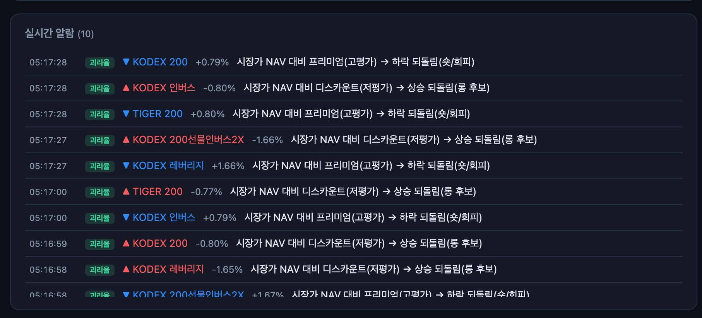

# 화면 속의 공짜 점심 — KOSPI200 차익거래 전략과 다섯 개의 함정

> *"Markets can remain irrational longer than you can remain solvent."* — 케인스에게 흔히 귀속되는 격언

9시. 시장이 열리고 대시보드의 알람 패널이 쉬지 않고 깜빡입니다.

KODEX 200은 NAV 대비 +0.79% 프리미엄이니 하락 되돌림(숏 후보), KODEX 인버스는 −0.80% 디스카운트이니 상승 되돌림(롱 후보). 1초 사이에 같은 지수를 추종하는 ETF들이 서로 반대 방향의 "기회"를 동시에 알려옵니다. 화면만 보면 돈이 바닥에 떨어져 있는 것처럼 보입니다.

이 글은 그 화면이 왜 대부분 신기루인지에 대한 이야기입니다. 저는 삼성전자·SK하이닉스(합산 KOSPI200의 약 55%)의 추세 확인된 움직임이 추종 ETF를 선행하는 구간과, ETF 시장가가 iNAV에서 벌어지는 괴리율 되돌림을 탐지하는 알람 봇을 만들어 공개했습니다([Kodex200 Arbitrage Bot](https://github.com/gameworkerkim/vibe-investing/tree/main/01.Trading%20Strategy/Kodex200%20Arbitrage%20Bot)). 만들었기 때문에, 이 전략이 어디서 부러지는지를 만든 사람의 책임으로 적어둡니다.

## 전략의 뼈대 — 왜 그럴듯해 보이는가?

논리는 단순합니다. 삼성전자(지수 비중 약 33%)와 SK하이닉스(약 22%)가 합쳐 KOSPI200의 절반 이상을 지배합니다. 빅2가 30초 만에 +1.7% 움직였는데 추종 ETF가 아직 못 따라왔다면, 그 시차(lead-lag)가 차익의 창이라는 가설입니다. 여기에 ETF 시장가와 iNAV의 괴리율이 평균으로 회귀한다는 두 번째 신호를 얹습니다.

2000년대 초반에는 실제로 이 시차가 존재했습니다. 하지만 지금은 LP(유동성공급자)와 기관 프로그램 차익거래가 그 틈을 직업적으로 메웁니다. 남아 있는 것은 급변동 구간의 초 단위 잔여 시차와 레버리지·인버스 ETF의 추적오차뿐이고 — 바로 그 남은 부스러기를 두고 개인이 기관과 경쟁하는 게임입니다. 이제 다섯 개의 함정을 차례로 보겠습니다.

## 함정 1 — 초당 호출 제한: 1초짜리 빨대로 0.1초의 세계를 본다

차익거래 창은 초 단위, 길어야 수십 초입니다. 그런데 리테일 API는 그 속도로 세상을 보여주지 않습니다. 한국투자증권은 API 신청 후 3일간 초당 3건으로 호출을 제한하고, 토스증권 Open API는 폴링 1초 이상과 약관상 rate limit 준수를 요구하며 캔들도 1분봉부터 제공합니다. 즉 여러분이 받아보는 시세는 도착하는 순간 이미 한 박자 늙어 있는 데이터입니다.

부수적인 사고도 흔합니다. 초보 개발자가 테스트 루프에서 sleep 없이 패킷을 날려 증권사 서버를 사실상 DDoS 공격하듯 두들기는 일 — 계정 차단으로 끝나면 다행이고, 약관 위반은 그 자체로 법적 문제가 됩니다. 이 봇이 폴링 간격을 강제하고 자동주문을 아예 포함하지 않는 이유입니다.

## 함정 2 — 밀리세컨드를 처리하지 못하는 인프라: 당신의 왕복 시간에 기회는 끝난다

REST 호출 한 번의 왕복은 수십~수백 밀리세컨드입니다. 시세 수신 → 판단 → 주문 전송 → 거래소 도달까지의 사슬에서 개인은 매 구간 줄을 섭니다. 반대편에는 KRX 코로케이션에 서버를 둔 기관과, ETF 설정·환매(creation/redemption)로 괴리율을 무위험에 가깝게 청산하는 LP가 있습니다. **화면에 보이는 괴리율은 대부분 둘 중 하나입니다 — 이미 누군가 먹는 중이거나, 호가가 멈춰 있어 생긴 착시이거나.**

착시의 대표적 예가 대시보드 안에 그대로 있습니다. KODEX 200선물인버스2X의 현재가는 84원, 표시된 괴리율은 +0.87%입니다. 그런데 이 가격대의 호가 단위는 1원 — **한 틱이 1.19%로, 괴리율 자체보다 큽니다.** 즉 그 "기회"는 호가 양자화가 만든 그림자일 수 있습니다. KODEX 인버스(975원)도 한 틱이 약 0.10%로, 0.38% 괴리의 4분의 1을 스프레드 한 칸이 잠식합니다. 반대로 호가가 촘촘한 KODEX 200 현물은 괴리율 자체가 −0.4% 수준으로 작고, 그 작은 틈은 LP의 본업입니다. **괴리가 클 만한 곳은 틱이 먹고, 비용이 작은 곳은 LP가 먹는다** — 이것이 이 전략의 구조적 비대칭입니다.

## 함정 3 — FDS: 시스템이 당신을 이상거래로 분류한다

짧은 간격의 반복 주문·정정·취소는 증권사 FDS(이상거래탐지시스템)의 전형적 탐지 패턴입니다. 알고리즘이 보기에 초단타 봇과 시세조종 시도는 종이 한 장 차이고, 판정은 여러분이 아니라 시스템이 합니다. 계좌 제한, API 키 회수, 거래소 시장감시 조회까지 — 전략이 수익을 내기 전에 인프라 접근권부터 잃을 수 있습니다. 고빈도 매매를 전제로 한 개인 전략은 수익성 이전에 **지속 가능성**부터 의심해야 합니다.

## 함정 4 — 55%는 100%가 아니다: 나머지 45%의 반란

빅2 합성지수는 KOSPI200의 절반을 설명하지만, 절반만 설명합니다. 나머지 198개 종목 — 금융·2차전지·바이오·방산 — 이 빅2와 반대로 움직이는 날, 여러분이 "ETF가 아직 못 따라왔다"고 읽은 갭은 사실 **이미 공정가**입니다. 합성지수는 부분 정보로 만든 프록시이지 지수가 아닙니다. 특히 섹터 로테이션이 빠른 장(반도체→전력기기→방산)에서는 빅2의 신호가 지수 전체를 대표하는 정도 자체가 흔들립니다. 선행 신호의 신뢰도는 상수가 아니라 **레짐에 따라 변하는 변수**입니다.

## 함정 5 — 시장은 늘 사건으로 움직인다. 신호가 가장 강한 순간이 가장 위험한 순간

lead-lag 신호가 가장 크게 울리는 때는 빅2가 급변할 때입니다. 그런데 정확히 그 순간에 개별 종목 VI(변동성완화장치)가 발동해 삼성전자 호가가 2분간 멈출 수 있고, 스프레드는 평소의 몇 배로 벌어지며, 한쪽 다리만 체결된 채 시장이 역행할 수 있습니다. 실적 쇼크, 지정학 뉴스, 서킷브레이커 — 차익거래의 역사는 "수렴한다"는 베팅이 수렴 전에 계좌를 먼저 수렴시킨 사례로 가득합니다. 1998년 LTCM은 노벨상 수상자들이 설계한 수렴 차익거래를 25배 차입 위에 올렸다가 46억 달러를 잃고 금융 시스템 전체를 흔들었습니다. 그들이 틀린 것은 방향이 아니라 **버틸 수 있는 시간**이었습니다.

그래서 단 하나의 규칙만 남긴다면 이것입니다. **차입(레버리지) 투자 금지.** 무차입이면 최악의 경우가 손실이지만, 차입이면 최악의 경우가 퇴장입니다.

## 그래서 이 봇은 무엇을 위한 도구인가?

이 전략은 검증 전입니다. 셀프테스트는 인위로 주입한 4초 시차를 정확히 복원했지만, 그것은 **방법론이 작동한다는 증명이지 시장에 기회가 존재한다는 증명이 아닙니다.** 실거래 판정에는 실시장 틱을 수개월, 어쩌면 몇 년간 기록하고(`ticks.csv`), 수수료·스프레드·슬리피지를 차감한 백테스트를 돌리고, 강세장·급락장·횡보장을 모두 통과시키는 혹독한 스트레스 테스트가 필요합니다. 그 지루한 축적 이전의 모든 확신은 화면이 만든 착시입니다.

이 봇이 알람·리서치 전용이고 자동주문을 포함하지 않는 것은 기능의 부족이 아니라 **설계의 결론**입니다. 도구의 역할은 시장을 이기는 것이 아니라, 가설을 데이터로 반증 가능하게 만드는 것입니다. 미래를 예측하지 않는다 — 관찰하고, 기록하고, 비용을 차감해 검증한다. 그래도 살아남는 신호만이 전략이라 불릴 자격이 있습니다.

6월 5일. 서킷 브레이크가 발생할 정도로 큰 이슈가 많았습니다. 브로드컴 충격에 반도체 매도 확대, 환율 급등까지 겹친 급락으로 분석합니다.
브로드컴은 사실 장사를 잘 했습니다. 그러나 시장의 탐욕이 그것조차 만족 못했을 뿐입니다.

반도체 대형주 매도가 오늘 하락의 중심에 있어습니다.
브로드컴 관련 충격이 반도체 투자심리를 먼저 식히면서, 삼성전자와 SK하이닉스에 매도가 집중됐되었습니다.

시총 상위인 삼성전자는 -6.40%, SK하이닉스는 -9.92%를 기록하고 있어서 지수 전체를 아래로 끌어내리는 힘이 컸습니다. 단일 종목 레버리지 etf도 충격을 더 했습니다.

더구나 환율이 1540원대로 치솟으면서 불안이 더 커졌습니다. 원·달러 환율이 장중 1540원대를 찍을 만큼 원화 약세가 강해지자, 외국인 자금이 한국 주식을 더 빨리 줄이는 흐름이 나타났습니다. 실제 원·달러 환율은 1539.8원 수준이고, 뉴스에서는 장중 1549.2원까지 올랐습니다.

개인은 받았지만, 외국인 매도가 시장을 눌렀습니다. 코스피에서는 개인이 순매수였지만 외국인과 기관이 함께 순매도를 했습니다.

지수는 크게 밀렸고, 오른 종목 수보다 내린 종목 수가 훨씬 많았습니다.
코스피는 -5.54%, 코스닥은 -4.50%를 기록.
코스피는 하락 종목이 672개로 상승 종목 225개보다 훨씬 많고, 코스닥도 하락 종목이 1298개로 상승 종목 389개를 크게 웃돌아서 일부 대형주만의 문제가 아니라는 점이 드러났습니다.

시장은 공포에 원래 모습을 보여줍니다. 비가 올 때 잠시 진흙탕을 피하는 지혜가 필요합니다.

---

> **면책 고지** — 본 칼럼과 관련 소프트웨어는 투자 권유가 아니며 어떤 수익도 보장하지 않습니다. 단기 차익거래는 스프레드·슬리피지·체결 실패·급격한 역행으로 원금 전액 손실이 가능한 고위험 기법입니다. 레버리지·인버스 ETF는 일일 2배 변동에 장기 보유 시 복리 손실(decay)이 누적됩니다. 저자는 면허가 있는 투자자문업자가 아니며, 모든 투자 판단과 책임은 전적으로 본인에게 있습니다. API 이용 시 각 증권사의 호출 제한과 약관을 반드시 준수하십시오.

*Dennis Kim (김호광) — [vibe-investing](https://github.com/gameworkerkim/vibe-investing)*
