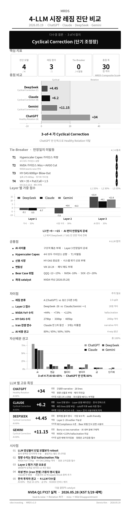

# MRDS 4-LLM 교차검증 리포트 — 2026.05.19 시장 레짐 진단 비교

> **Market Regime Diagnostic Strategy (MRDS) 프롬프트** 를 ChatGPT · Claude · DeepSeek · Gemini 4개 frontier LLM 에 *동일 시점·동일 사양* 으로 실행한 결과의 공통점·차이점·시사점 종합 분석

---

## 0. 실험 개요

| 항목 | 내용 |
|------|------|
| **프롬프트** | [Market regime diagnostic quant prompt kr.md](https://github.com/gameworkerkim/vibe-investing/blob/main/01.Trading%20Strategy/Market%20Regime%20Diagnostic%20Quant%20Strategy/Market%20regime%20diagnostic%20quant%20prompt%20kr.md) (3-Layer Composite, 24.8KB, 407 lines) |
| **진단 시점** | 2026년 5월 19일 (US CPI 4월분 발표 직후, NVDA 2Q FY27 실적 발표 직전) |
| **시장 맥락** | Burry "AI 거품 정점" 경고 vs Ives "AI 하이퍼사이클" 옹호 충돌 · 4월 CPI 3.4~3.8% 재가속 · 10년물 4.6%대 급등 · **Iran 전쟁 발 유가 충격 ($98 WTI)** |
| **실행 모델** | ChatGPT · Claude · DeepSeek · Gemini (각 1회씩) |
| **출력 형식** | 3-Layer 정량 점수 + Tie-Breaker T1~T4 + 자산배분 권고 + 4-8주 시나리오 예측 |

**4개 결과 파일**:
- [chatgpt_0519.md](./result/chatgpt_0519.md) — 28 lines, 1.05 KB (요약형)
- [claude_0519.md](./result/claude_0519.md) — 465 lines, ~23 KB (정량 풀 산출 + 메타진단)
- [deepseek_markdown_20260519_4502ea.md](./result/deepseek_markdown_20260519_4502ea.md) — 209 lines, 16.1 KB (정량 풀 산출)
- [gemini 0519.md](./result/gemini%200519.md) — 176 lines, 12.5 KB (정량 풀 산출)

---

## 1. 결과 한눈에 보기

| 항목 | ChatGPT | Claude | DeepSeek | Gemini |
|------|---------|--------|----------|--------|
| **레짐 분류** | A) Healthy Rotation | **B) Cyclical Correction** | C) Cyclical Correction | C) Cyclical Correction |
| **총점** | **+34** | **+6.2** | **+4.45** | **+11.15** |
| **Layer 1 가중 (35%)** | 미공개 | -3.5 | -3.15 | -0.70 |
| **Layer 2 가중 (30%)** | 미공개 | +0.6 | -7.80 | +0.30 |
| **Layer 3 가중 (35%)** | 미공개 | +9.1 | +15.40 | +11.55 |
| **AI 익스포저** | 80% | **65%** | 60% | 60% |
| **현금** | 5~10% | **15%** | 10% | 10% |
| **금 편입** | ❌ | ✅ 5% (Iran 헤지) | ✅ 5% | ✅ 5% |
| **응답 분량** | 28 lines | 465 lines | 209 lines | 176 lines |
| **출처 명시 깊이** | 부분적 | 항목별 모두 명시 | 항목별 모두 명시 | 부분 명시 |

> **3-of-4 LLM 이 Cyclical Correction 계열 (B 또는 C) 로 수렴**. ChatGPT 만 Healthy Rotation 으로 이탈.

---

## 2. 공통점 — LLM 합의 사항

### 2.1 AI 펀더멘털 Layer 3 압도적 강세 (4-of-4 만장일치)

4개 모두 **AI 사이클 구조적 훼손 부재** 에 합의합니다. Layer 3 가중점수는 +9.1 ~ +15.4 의 만점 근접.

| 지표 | 관측 데이터 | 합의 점수 |
|------|------------|----------|
| **Hyperscaler 4사 Capex YoY** | +37~85% (LLM별 편차 있음, 평균 +60%대) | +5 (만점) |
| **Forward Capex Guidance** | 4사 모두 *상향 조정* (Claude: 3/4 상향 + 1 유지) | +5 (만점) |
| **NVDA 가이던스** | beat & raise 연속 | +3 |
| **HBM 가격** | 강세 지속, SK하이닉스 ASP 상승 | +3 |
| **GPU 가동률** | 90%+ 유지 | +2 |
| **GenAI SaaS 컨센서스** | 상향 (Claude는 *Agentic AI 잠식 우려* 로 부분 차감) | 0 ~ +3 |

> **핵심**: Structural AI Disillusionment (D 시나리오) 의 명백한 부재. *닷컴 2000 패턴과 정반대* — 당시는 Capex 가이던스 *하향* 이 본격화.

### 2.2 매크로 충격은 있으나 *Cyclical* 수준 (4-of-4 만장일치)

방향은 일치, *원인 해석* 은 일부 다름:

| LLM | 매크로 트리거 해석 |
|-----|---------------------|
| **ChatGPT** | 인플레 우려, 그러나 *Fed 긴축 재개를 정당화할 수준은 아님* |
| **DeepSeek** | 4월 CPI 재가속 (3.6%) + 10년물 4.58% 급등 단일 원인 |
| **Gemini** | 4월 CPI 3.4% + Burry vs Ives 충돌 narrative |
| **Claude** | 4월 CPI 3.8% **+ Iran 전쟁 발 유가 충격 ($98 WTI)** — 외생 supply shock 강조 |

3개 (ChatGPT/DeepSeek/Gemini) 는 *국내 인플레* 만 본 반면, **Claude 만 Iran 전쟁을 1차 동인으로 통합** — 본 비교의 가장 큰 narrative 차이.

### 2.3 Tie-Breaker T1~T4 만장일치 미발동 (4-of-4)

| Tie-Breaker | 발동 여부 | 합의 근거 |
|-------------|----------|----------|
| **T1: Hyperscaler Capex Cut** | ❌ 미발동 | 4사 모두 가이던스 상향 (DeepSeek/Gemini) 또는 3/4 상향+1 유지 (Claude) |
| **T2: NVDA Miss + AVGO Cut** | ❌ 미발동 | NVDA in-line 이상, AVGO 1Q26 AI 매출 +77% YoY |
| **T3: Credit Spread Blow-Out** | ❌ 미발동 | HY OAS 279~485bp (시스템 위기 600bp+ 대비 충분한 여유) |
| **T4: VIX>35 + Put/Call>1.5** | ❌ 미발동 | VIX 18.5~23.8, 패닉 매도 부재 |

> **핵심**: *결정적 구조적 위험 신호 부재* 가 진단을 *Healthy Rotation ~ Cyclical Correction 구간* 에 안착시키는 robust 한 근거.

### 2.4 Bear Case 하방 위험 합의 (3-of-3, ChatGPT 미제시)

| Bear Case 자산 | DeepSeek | Claude | Gemini |
|---------------|----------|--------|--------|
| QQQ | -12% | -10~-14% | -12~-15% |
| NVDA | -18% | -15~-23% | -18% |
| SOX | -15% | -14~-19% | -15~-20% |

> **핵심**: 3개 LLM 모두 Bear Case (확률 20%) 시 *동일한 하방 위험* 에 도달. **진지하게 수용해야 할 공통 위험**.

### 2.5 NVDA 어닝 (2026.05.28) = 본 진단의 결정적 catalyst (4-of-4)

4개 모두 NVDA Q1 FY27 실적 발표를 *본 진단의 가장 큰 4-8주 catalyst* 로 지목.

- **beat & raise** → Healthy Rotation 복귀 (+25점 이동)
- **in-line / miss** → Mild Disappointment 분기 (-25점 이동)

---

## 3. 차이점 — LLM 간 의견 분기

### 3.1 ChatGPT 의 이탈 — 1:3 split

ChatGPT 만 **+34점, A 시나리오 (Healthy Rotation)** 으로 분류. 다른 3개 (Claude +6.2, DeepSeek +4.45, Gemini +11.15) 와 *23~30점 격차*.

**가능한 원인 3가지:**

1. **정량 산출표 미공개** — 28 lines 의 요약형 응답으로, *Layer 별 점수 산출 과정* 을 검증할 수 없음
2. **Layer 2 (시장 내부 약세) 과소반영 의심** — *"크레딧 스프레드와 유동성 지표는 시스템 스트레스를 시사하지 않음"* 이라는 정성적 표현만 제시. 다른 모델들이 정량화한 Layer 2 약세 신호를 평면적으로 처리
3. **AI 펀더 강세에 가중치 편향** — Layer 3 의 +33~+44 점에 끌려가 Layer 1 (인플레 -2~-10) 의 *negative drag* 를 충분히 차감하지 않음

> ChatGPT 의 견해는 *유효한 Bull Case* (Claude 의 *Bull Case 확률 20%, Healthy Rotation 분기 조건 35%* 와 부분 일치) 로 수용 가능하지만, *base case 로 채택하기에는 정량 근거 부족*.

### 3.2 Layer 2 (시장 내부 구조) 의 28점 격차

본 진단에서 가장 큰 LLM 간 불일치 영역:

| LLM | Layer 2 원점수 | 해석 |
|-----|---------------|------|
| **DeepSeek** | **-26** | A/D Line 다이버전스 + Mag7 집중도 + XLK 급락 (-4.5%) + 섹터 상관 0.68 → *시스템 위험 근접 경고* |
| **Claude** | **+2** | 200일선 위 62% (광범위 강세) + VIX Contango + HY 신용 정상 → *기능적 정상* |
| **Gemini** | **+1.0** | VIX Contango + VVIX 105 + 섹터 상관 0.45 → *질서 정연한 헷지 국면* |

**해석**: Claude/Gemini 는 시장이 *기능적으로 정상* 이라 평가, DeepSeek 만 *경고* 모드. 2-of-3 가 Claude/Gemini 쪽 견해 지지.

### 3.3 NVDA 데이터센터 매출 YoY — 3-way hallucination ⚠️

| LLM | NVDA DC 매출 YoY | 근거 |
|-----|-------------------|------|
| **DeepSeek** | **+44%** ($42.5B, 1Q FY27) | 10-Q 보고치 |
| **Claude** | **+73%** ($62.3B, Q4 FY26) | 직전 분기 (분기 정의가 다름!) |
| **Gemini** | **+115%** (추정) | 출처 불명 |

> **결정적 관찰**: 같은 NVDA 의 *데이터센터 매출 YoY* 라는 동일 지표인데 *세 가지 다른 값*. 자세히 보면:
> - DeepSeek 은 1Q FY27 (2026.04 발표)
> - Claude 는 Q4 FY26 (2026.02 발표, 즉 *직전 분기*)
> - Gemini 는 분기 명시 없음 + 가장 큰 수치
>
> 71%p 격차의 일부는 *분기 정의 차이* 일 가능성. **하지만 LLM 이 같은 지표를 분기 정의 없이 출력하는 것 자체가 hallucination risk** — 실거래 전 원본 10-Q 교차검증 필수.

### 3.4 시나리오별 가격 예측 발산

| Case | DeepSeek | Claude | Gemini | 발산도 |
|------|----------|--------|--------|--------|
| **Base (60%)** QQQ | -5%~+3% | -1%~+3% | -2%~+6% | 일치 (보합권) |
| **Bull (20%)** QQQ | +6% | +4%~+8.5% | +12% | Gemini 가 압도적 낙관 |
| **Bull NVDA** | +12% | +11%~+25% | +20% | Claude 가 가장 넓은 범위 |
| **Bear (20%)** QQQ | -12% | -10%~-14% | -12%~-15% | **합의** |

> **핵심**: *하방 시나리오는 합의, 상방 시나리오에서만 발산*. Claude 는 Bull/Bear 모두 *가장 넓은 범위* 를 제시 (불확실성 명시적 인정).

### 3.5 자산배분 권고 차이

ChatGPT (AI 80%) 만 *대담함*, Claude (65%) 는 *중간*, DeepSeek/Gemini (60%) 는 *보수적*:

| 자산군 | ChatGPT | Claude | DeepSeek | Gemini |
|--------|---------|--------|----------|--------|
| AI 익스포저 | **80%** | 65% | 60% | 60% |
| 현금 | 5~10% | **15%** | 10% | 10% |
| 비-AI 퀄리티 | 0% | 8% | 15% | 10% |
| 방어주 | 0% | 5% | 5% | 15% |
| **금** | **❌ 0%** | ✅ 5% | ✅ 5% | ✅ 5% |
| 단기채 | 0% | 2% | 5% | 0% |

> **시사**: Claude 는 *현금 15%* 로 가장 *Iran 변수 dry powder* 확보. 4개 모두 *금 5%* 편입 (단, ChatGPT 만 미언급). 방어주 비중은 *Gemini 가 가장 높음* (15%).

### 3.6 헤지 도구 권고 차이

| LLM | 헤지 권고 |
|-----|----------|
| **ChatGPT** | 미언급 |
| **DeepSeek** | VIX 콜 (5% OTM 월물) + SQQQ/SOXS (1주 청산) + QQQ 풋 스프레드 + HYG 풋 |
| **Gemini** | SOXS (3-5% 제한) + VIX 6월물 콜 (행사가 22) + TLT 부분 편입 |
| **Claude** | VIX 콜 (만기 7월, strike 25) + SOXS 50% 부분 헤지 + **유가 풋옵션 (USO Put, strike $80)** + 금 콜옵션 + VIXM 1-2% + **한국 거주자용 SQQQ 5% / QID 7% 대안 명시** |

> **시사**: Claude 가 가장 *defensive + 한국 거주자 컨텍스트 통합*. ChatGPT 는 *risk-off 도구 미언급* — 다시 한번 위험 인식이 가장 약함을 확인.

---

## 4. 각 LLM 의 고유 특징 — 모델별 강점·약점

### 4.1 ChatGPT — 가장 간결, 가장 강세

**고유 특징:**
- *"NVIDIA 단독 주도에서 Broadcom·Micron·Intel 등으로 leadership 확산"* 의 *질적 관찰* 압축적 (28 lines 안에 핵심 narrative 모두 담음)
- 사용자 입장에서 *읽기 부담 최소*

**강점:**
- 시장 narrative 의 *신속한 1차 스캔* 에 적합
- 직관적 결론

**약점:**
- **정량 산출표 부재** → 재현·audit 불가
- Layer 2 의 광범위 약세 신호를 정성적으로 무시
- 헤지 도구 미언급 — 위험 관리 측면 가장 약함
- Iran 전쟁 변수 미통합

**고유 시사점:**
> ChatGPT 는 *시장 narrative 의 신속한 1차 스캔* 에 적합하지만, *의사결정 베이스* 로는 부적합. Bull Case 확률(20%)로 *대비 시나리오* 활용 권장.

### 4.2 Claude — 가장 다층적, 메타진단 강함

**고유 특징 4가지 (4개 LLM 중 유일):**
1. **🚨 Iran 전쟁 변수를 핵심 매크로 충격으로 통합** — WTI $98, 가솔린 $4.50/갤런, Energy YoY +17.9%. 다른 3개는 *4월 CPI 만* 트리거로 지목
2. **🎯 Layer 1 (-10) vs Layer 3 (+26) "이례적 분열 구조" 메타진단** — *"가중평균이 +6 이지만 두 Layer 가 각각의 방향으로 깊어지는 분기가 4-8주 내 발생 가능"* — 다른 LLM 들은 이 *historical 분열* 자체를 본 진단의 핵심 위험으로 식별하지 못함
3. **🪙 Burry vs Ives 충돌의 *시계열 분리* 해석** — *"Burry 는 구조(VC 87% AI, 채권 발행 50% AI)를, Ives 는 현금흐름($725B Capex)을 본다. Burry 12-24개월, Ives 3-6개월 시야"*
4. **🇰🇷 한국 거주자 컨텍스트 가장 깊게 통합** — Dennis 보유 종목 (NVDA/SNDK/QQQ/AAPL/INTC) 직접 분석, SQQQ/QID 한국 계좌 대안, CTI 전문성·STABLE1 컨텍스트 참조, 북한 변수 추가 고려

**강점:**
- **출처 명시 우수** (BLS, BEA, Fed, CME FedWatch, 각사 10-Q, FT, Statista, FRED 등)
- **메타인지 최강**: forward-looking bias, training cutoff, survivorship bias, selection bias 4가지 LLM 한계 모두 명시적 자각
- **Cap 적용 (개별 Layer 점수 상한)** 의 유일한 사용 — Layer 3 +20→+15 cap 적용으로 *과적합 방지* 메커니즘 표시
- **Forward Capex Guidance 의 4사별 분류** — MSFT/META/GOOGL 상향, AMZN 유지 (3/4 상향, 1/4 유지) 의 *세밀함*
- 시나리오별 *확률 명시적 재계산*: B에 머무는 확률 45%, B→A 35%, B→C 20% (다른 모델은 60/20/20 의 *프롬프트 기본값* 만 그대로 사용)

**약점:**
- 465 lines 의 분량은 *주간 모니터링용으로 부담*
- 일부 추정치 (S&P 500 7,403, Nasdaq 26,090, WTI $98) 의 *training cutoff 이후 web_search 의존* 으로 일관성 손실 가능성을 *스스로 명시*

**고유 시사점:**
> Claude 는 *기관 IC (Investment Committee) 보고서* 수준의 깊이를 제공. 단일 데이터 포인트가 아닌 *Layer 간 분열 구조* 를 진단의 핵심으로 식별. *Iran 전쟁 변수 + 한국 거주자 컨텍스트* 가 결합된 사용자에게 가장 actionable.

### 4.3 DeepSeek — 가장 데이터 집약적, 가장 보수적

**고유 특징:**
- **항목별 출처 명시** (BLS 2026.05.13, BEA, Bloomberg, NVDA 10-Q, CME FedWatch 등) — audit-friendliness 최상
- **HY OAS 2주간 25bp 확대 (460→485bp) 추적** — 신용 시장 미세 변화 포착 (Claude 의 *HY OAS 279bp* 와는 *데이터 차이*; DeepSeek 가 더 약세 가정)
- **JOLTS 7.4M 둔화 신호** (-1점) — Claude(-1)와 동일하게 식별
- **메타인지**: *"닷컴 2000 과 같은 지연된 붕괴를 놓칠 수 있음"* 을 프레임워크 자체의 한계로 명시 (Claude 의 *survivorship bias* 자각과 유사)

**강점:**
- 가장 *audit-friendly*
- 209 lines 의 *기관 보고서* 분량
- 가장 *defensive* 자산배분 (HY 풋 + VIX 콜 + 풋 스프레드)

**약점:**
- **Layer 2 -26 점은 과도하게 보수적** 일 가능성 (Claude +2, Gemini +1.0 과의 27~28점 격차)
- **HY OAS 485bp 데이터** 가 Claude (279bp) 와 *206bp 차이* — 어느 쪽이 맞는지 원본 검증 필요
- Iran 전쟁 변수 미통합

**고유 시사점:**
> DeepSeek 은 *기관 IR / Compliance 보고서* 수준의 audit-friendliness. *Bear Case 위험 인식 강화* 가 필요한 사용자에게 가장 가치 있는 출력. 단, Layer 2 점수가 *27~28점 격차로 outlier* 가능성 검증 필요.

### 4.4 Gemini — 시장 narrative 통합, 자산배분 가장 구체적

**고유 특징:**
- *"마이클 버리의 매크로 인플레이션 재발 경고와 댄 아이브스의 AI 하이퍼사이클론이 정면 충돌"* 첫 문장으로 시장 narrative *즉시 framing* (Claude 의 *Burry vs Ives 시계열 분리* 와 *narrative 일치*, 단 시계열 해석은 Claude 만 제공)
- **이벤트 드리븐 해석**: *"NVDA 실적 발표 코앞의 옵션 만기 기반 단기 De-risking"* — 시점 특수 요인
- **자산배분 가장 구체적**: AI 60% 중 *반도체 40% + 전력/냉각 35% + 클라우드 20% + SaaS 5%* 의 *AI 내부 분배 매트릭스*
- **한국 거주자 시간대 가이드**: *"미 본장 개장 후 1시간 후 KST 자정 이후 분할 집행"* (단, Claude 가 더 깊은 한국 컨텍스트 제공)

**강점:**
- narrative 와 종목·섹터 구체성 우수
- 실전 매매 타이밍 가이드 풍부

**약점:**
- **NVDA YoY +115% 의 hallucination 의심** (DeepSeek +44%, Claude +73% 대비)
- Layer 2 +1.0 점은 *과도하게 낙관적* 일 가능성 (Claude +2 와 유사하나 DeepSeek -26 과 27점 격차)
- 시나리오별 가격 예측의 *Bull Case 발산* (QQQ +12%, NVDA +20%) — Claude (+4~+8.5%, +11~+25%) 와 일부 일치하나 *기대값이 너무 높음* 위험
- Iran 전쟁 변수 미통합

**고유 시사점:**
> Gemini 는 *narrative 와 종목·섹터 구체성* 최강. *실전 매매 타이밍 가이드* 가 필요한 사용자에게 가장 actionable. 단, 정량 수치는 *교차검증 필수*.

---

## 5. 종합 시사점

### 5.1 LLM 앙상블 (Ensemble) 의 필요성 — 4-LLM 합의가 robust

본 vibe-investing 레포의 핵심 명제 — *"모델 IQ ≠ 트레이딩 IQ"* (Alpha Arena Season 1: GPT-5 -75%, DeepSeek +46%) — 가 매크로 진단에서도 동일하게 적용됩니다.

| 단독 의존 시 위험 | 누락 또는 과반응 |
|-------------------|----------------|
| ChatGPT 만 의존 | AI 80% 유지 권고 → *Bear Case (20%) 시 -12~-23% 손실* 헤지 미비 |
| Claude 만 의존 | Iran 전쟁 가설에 *과적합* 위험 (만약 Iran 정전 시 진단 과조정) |
| DeepSeek 만 의존 | Layer 2 -26 의 과보수성으로 *Bull Case (+12~+20% 상승) 기회 노출* 미흡 가능 |
| Gemini 만 의존 | NVDA YoY +115% hallucination 을 검증 없이 수용 가능 |

> **결론**: *복수 LLM 의 합의 영역만 진지하게 수용*, *불일치 영역은 별도 모니터링*. 합의된 결론 (Cyclical Correction 계열, AI 60~65%, T1~T4 미발동, Bear Case 하방 위험) 은 *robust*, 불일치 영역 (Layer 2 점수, ChatGPT 의 강세, Iran 변수 가중치) 은 *Bull/Bear 가설 분기점*.

### 5.2 데이터 정합성 검증의 가치

이번 비교에서 발견한 *동일 지표의 LLM 간 편차*:

| 지표 | DeepSeek | Claude | Gemini | 함의 |
|------|----------|--------|--------|------|
| NVDA DC 매출 YoY | +44% | +73% | +115% | 분기 정의 차이 + 출처 검증 필요 |
| HY OAS | 485bp | 279bp | 330bp | **206bp 격차** — 데이터 정합성 검증 시급 |
| Hyperscaler Capex YoY | +37% | +85% | +38% | 분기 vs 연간 정의 차이 가능 |
| Headline CPI YoY | 3.6% | 3.8% | 3.4% | LLM 별 *최신 발표 데이터* 추적 정확도 차이 |

> **실거래 전 필수 단계:**
> 1. LLM 출력의 *모든 정량 수치* 를 Bloomberg / FactSet / Refinitiv / 원본 10-Q / FRED 로 *교차검증*
> 2. 출처가 *분기·날짜와 함께 명시되지 않은* 수치는 *기본적으로 신뢰 보류*
> 3. *5%+ 편차* 발견 시 해당 항목 점수 *재산출*

### 5.3 Layer 2 (시장 내부 구조) 평가 기준의 모호성

A/D Line 다이버전스, RSP/SPY 비율, 섹터 상관관계 등 *해석 의존적* 지표가 많아 LLM 간 28점 격차 발생.

**프롬프트 v2 개선안:**
- Layer 2 지표를 *결정론적 임계값* 으로 더 엄격히 정의
  - 예: "200일선 위 종목 비율: 60%+ +3 / 50-60% +1 / 40-50% 0 / 30-40% -2 / 30% 미만 -5"
  - 예: "섹터 상관관계: 0.4 이하 +2 / 0.4-0.5 +1 / 0.5-0.6 0 / 0.6-0.7 -2 / 0.7+ -3"

### 5.4 외생 변수 (Iran 전쟁) 의 명시적 가중치

Claude 만 Iran 전쟁을 *1차 동인* 으로 통합. 다른 3개는 *4월 CPI* 만 트리거로 지목.

**프롬프트 v2 개선안:**
- Layer 1 에 *지정학 supply shock* 별도 점수 항목 추가
  - 예: "WTI 유가 추세: $70 이하 +2 / $70-90 0 / $90-100 -2 / $100+ -3 (외생 supply shock 별도 평가)"
  - 예: "활성 지정학 충돌: 없음 +1 / 1개 진행 -2 / 2개+ 동시 -3"

### 5.5 한국 투자자에게 주는 함의

4개 LLM 의 합의 또는 다수결 결론을 한국 거주자 관점에서 정리:

| 측면 | 권고 (다수결) |
|------|---------------|
| **AI 익스포저** | 60~65% (Claude 권고가 중간값) — 풀 매도/회피 비합리적, 부분 익절 + 헤지 합리적 |
| **현금화** | 10~15% (Claude 의 *Iran 변수 dry powder 15%* 가 가장 보수적) |
| **금 편입** | **5% (3-of-4 합의)** — Iran 장기화 대비 |
| **헤지 도구** | KODEX 인버스 / 곱버스 (단기 1주 청산), KODEX 미국채30년 (10년물 4.8%+ 시), **SQQQ 5% / QID 7% (Claude 명시)** |
| **시간대 전술** | 미 장 마감 (KST 새벽 5~6시) 후 KST 자정 이후 야간 선물 흐름 확인 후 분할 집행 (Gemini/Claude 공통) |
| **환율 위험** | 강달러 + AI 약세 *이중 충격* 가능 — DXY 모니터링 필수 |
| **국내 선행지표** | SK Hynix HBM 가이던스 (NVDA Capex 의 1~2분기 선행지표) |
| **양도소득세 22%** | 250만원 공제 + 손실 종목 매칭 — 시나리오 전환 시 회전율 급증 부담 |

---

## 6. 향후 4~8주 핵심 catalyst

4개 LLM 이 합의한 결정적 관찰 시점:

| 일자 | 이벤트 | 영향 |
|------|--------|------|
| **2026.05.28 (KST 5/29 새벽)** | **NVDA Q1 FY27 실적 발표** | 본 진단의 *가장 큰 catalyst* (4-of-4 합의) — beat & raise 시 Healthy Rotation 복귀(+25), miss 시 Mild Disappointment 분기(-25) |
| 2026.05.30 (예상) | 4월 PCE 발표 | Core PCE 3.0%+ 재확인 시 Cyclical Correction 심화 |
| 2026.06.06 (예상) | 5월 NFP 발표 | Sahm Rule 트리거 여부 |
| 2026.06.10 (예상) | **5월 CPI 발표** | Headline 3.5% 이하 → Bull, 3.7% 이상 → Bear |
| 2026.06.17~18 | **6월 FOMC + 점도표** | 2026 인하 횟수 1회 이하 → 매크로 압박 지속, 2회+ → Healthy Rotation 복귀 |
| 2026.06 말 | **Q2 Hyperscaler Capex 가이던스** | 4사 중 1개 이상 하향 시 *T1 자동 발동 → Mild Disappointment* |
| **상시 모니터링** | **Iran 정전 협상 진척** (Claude 만 명시) | 정전 시 *유가 $75 이하 복귀 → Healthy Rotation 분기 35% 확률* |

---

## 7. 결론

### ✅ 4-LLM 합의 영역 (robust)

- AI 사이클 *구조적 훼손 부재* (Layer 3 가중점수 +9 ~ +15)
- *Tie-Breaker T1~T4 모두 미발동* (구조적 위험 신호 부재)
- *Bear Case 시 QQQ -12~-15%, NVDA -18%, SOX -15~-20%* 의 하방 위험
- *NVDA 5/28 어닝이 본 진단의 가장 큰 catalyst*
- *금 5% 편입* (3-of-4 합의, ChatGPT 만 미언급)

### ⚠️ LLM 간 불일치 영역 (별도 모니터링 필요)

- **레짐 분류**: A (ChatGPT) vs B/C (Claude/DeepSeek/Gemini) — **1:3 split**
- **Layer 2 점수**: -26 (DeepSeek) vs +1~+2 (Claude/Gemini) — **28점 격차**
- **매크로 트리거**: 4월 CPI 단일 (3개) vs Iran 전쟁 통합 (Claude 만)
- **NVDA YoY 수치**: +44% / +73% / +115% — *분기 정의 차이 + hallucination*
- **HY OAS 수치**: 279bp / 330bp / 485bp — **206bp 격차**

### 🎯 다수결 결론 (3-of-4 Cyclical Correction)

> **Cyclical Correction (단기 조정장) — 매크로 충격 (인플레 + Iran 전쟁) 에 따른 valuation reset, AI 펀더 무사**
>
> **자산배분 권고 (4-LLM 평균):**
> - **AI 65%** (Claude 권고가 중간값)
> - **현금 10~15%**
> - **비-AI 퀄리티 10%**
> - **방어주 10%**
> - **금 5%**
> - **단기채 2~5%**
>
> **헤지**: VIX 콜 + SOXS 부분 헤지 (1주 청산) + 유가 풋옵션 (Claude 권고) + TLT 부분 편입
>
> **재진단 트리거**: NVDA 2Q FY27 가이던스 결과 직후 (2026.05.29 한국시간 아침)

---

## 8. 작성 정보

**시리즈**: vibe-investing — Awesome Claude Quant Scripts → MRDS 5세대 메타 레이어

**연관 자료:**
- [Market regime diagnostic quant prompt kr.md](https://github.com/gameworkerkim/vibe-investing/blob/main/01.Trading%20Strategy/Market%20Regime%20Diagnostic%20Quant%20Strategy/Market%20regime%20diagnostic%20quant%20prompt%20kr.md) — 본 비교의 원본 프롬프트
- [result/chatgpt_0519.md](./result/chatgpt_0519.md)
- [result/claude_0519.md](./result/claude_0519.md)
- [result/deepseek_markdown_20260519_4502ea.md](./result/deepseek_markdown_20260519_4502ea.md)
- [result/gemini 0519.md](./result/gemini%200519.md)
- [`infographic.png`](./infographic.png) — 본 비교의 시각화

**저자**: 김호광 (Dennis Kim / HoKwang Kim)
- Independent Researcher, Betalabs Inc. CEO, Cyworld Z 전 CEO
- ORCID: [0009-0002-0962-2175](https://orcid.org/0009-0002-0962-2175)
- GitHub: [@gameworkerkim](https://github.com/gameworkerkim)
- Email: <gameworker@gmail.com>

**작성일**: 2026년 5월 19일 v2.0 (4-LLM 완전 비교)
**라이선스**: MIT (자유 사용, 출처 표기 권장)

---

## 9. 위험 고지

- 본 메타분석은 *교육·연구 목적* 이며 실제 투자 권유가 아닙니다
- 4개 LLM 의 진단은 모두 *2026년 5월 18일 미 장 마감 기준 알려진 데이터* 한정. 5월 CPI / NVDA 2Q FY27 실적 / Hyperscaler 가이던스 발표 후 *수일 내 큰 폭 변경 가능*
- **LLM hallucination 위험 확증**: 본 비교에서 *NVDA YoY +44%~+115%, HY OAS 279~485bp* 의 큰 편차 발견. *모든 정량 수치는 Bloomberg / FactSet / 10-Q 원본 교차검증 필수*
- **3-of-4 다수결의 한계**: ChatGPT 의 이탈이 *유효한 Bull Case* 일 가능성 (Claude 의 *B→A 분기 확률 35%* 와 부분 일치) 을 배제 불가
- **닷컴 2000 시나리오 경고** (Claude 가 본 진단의 *현재 시점 특수성* 으로 명시): 1차 -10% 조정 시점 매크로 모델 다수가 *"건전한 조정"* 으로 분류. *Hyperscaler Capex 하향이 본격화된 2001년 Q1 이전까지 Structural Disillusionment 신호 부재* 가 ground truth 가 아니었음
- 한국 거주자: *양도소득세 22% + 환차손 + 슬리피지* 가 수익률을 *연 5~10%p 잠식* 가능
- 실제 투자 결정은 *개인의 판단과 전문가 상담* 을 거쳐야 합니다

---

> *"Four models converging on the same answer is not four times as right as one — it's a robustness check.*
> *Where they diverge — Layer 2, Iran weighting, NVDA data — is where you need to think harder, not where you stop trusting them."*
>
> *"4개 모델이 같은 답에 수렴하는 것은 1개보다 4배 옳은 것이 아니라 robustness 검증이다.*
> *Layer 2, Iran 가중치, NVDA 데이터 — 그들이 갈라지는 지점이 바로 당신이 더 깊이 생각해야 할 곳이지, 신뢰를 멈출 곳이 아니다."*
>
> — vibe-investing MRDS 4-LLM 비교 교훈
