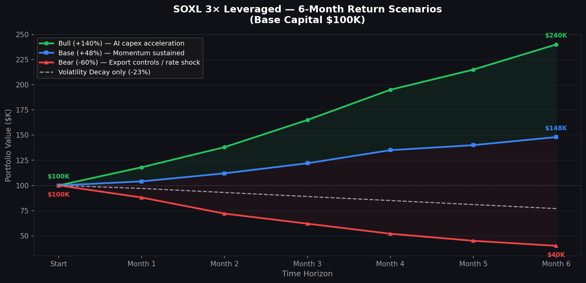
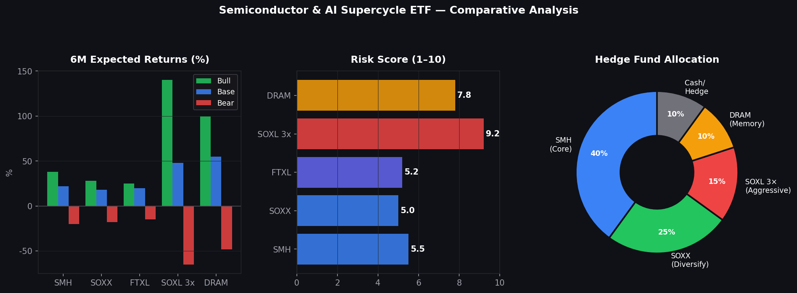
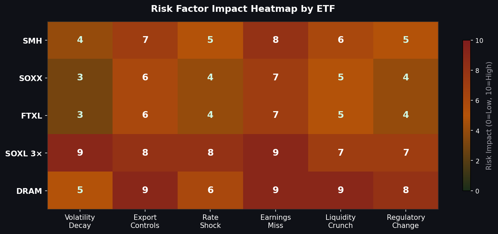

# 반도체·AI 슈퍼사이클 레버리지 ETF 전략 분석
**작성 기준일:** 2026년 5월 27일  
**작성자 관점:** 퀀트 전문가 / 헤지펀드 15년 이상 운용 경험  
**분석 대상 기간:** 6개월 (2026년 6월 ~ 2026년 11월)

---

> ⚠️ **리스크 고지 (필독)**  
> 본 문서는 투자 참고 목적의 정보 제공 자료이며, 특정 금융상품의 매수·매도를 권유하거나 투자 결과를 보장하지 않습니다. 레버리지 ETF는 일반 ETF 대비 손실 위험이 수배 이상 크며, 원금 전액 손실 가능성을 포함합니다. 모든 투자 결정의 책임은 투자자 본인에게 있으며, 투자 전 반드시 전문 금융투자업자와 상담하시기 바랍니다.

---

## 1. 현재 시장 컨텍스트 (2026년 5월 기준)

2026년은 반도체·AI 슈퍼사이클이 본격화된 해로 기록될 가능성이 높다.

- **자금 유입 규모**: 2026년 4월 한 달간 SMH와 SOXX 두 펀드에만 합산 약 55억 달러 자금 유입 — 월간 역대 최고치
- **거래량 폭발**: SOXL + SOXS 합산 일평균 거래량 약 3억 3천만 주 (16개월 최고, 5년 주간 거래량 상위 1%)
- **필라델피아 반도체지수(SOX)**: 같은 기간 약 +38.7% 상승
- **핵심 드라이버**: AI 데이터센터 capex 가속, 하이퍼스케일러(Microsoft Azure, AWS, Google Cloud, Meta) AI 인프라 투자 확대, 메모리 공급 부족 구조화

**결론적으로, 반도체 슈퍼사이클 테마는 가상자산을 압도하는 2026년 최고의 핫트레이드다.**

---

## 2. 추천 ETF 비교

### 2-1. 핵심 ETF 4종 요약

| ETF | 운용사 | 레버리지 | 추적 지수 | AUM | 운용보수 | 리스크 수준 |
|-----|--------|----------|-----------|-----|----------|------------|
| **SMH** | VanEck | 1× (무레버리지) | MVIS US Listed Semiconductor 25 | ~$58.5B | 0.35% | 중간 |
| **SOXX** | iShares | 1× (무레버리지) | NYSE Semiconductor (~30종목) | 대형 | 0.35% | 중간 |
| **FTXL** | First Trust | 1× (무레버리지) | Nasdaq Semiconductor (대형주 중심) | 중형 | 0.60% | 중간 |
| **SOXL** | Direxion | **3×** (일간 리셋) | PHLX Semiconductor Index | 대형 | 0.75% | 매우 높음 |
| **DRAM** | Roundhill | 1× (집중형) | 메모리 반도체 9종목 | 신규 | - | 높음 |

### 2-2. ETF별 상세 특성

#### SMH — 코어 포지션의 표준 (추천 비중 40%)

SMH는 MVIS US Listed Semiconductor 25 Index를 추적하며, NVIDIA와 TSMC 등 상위 3~4개 종목이 펀드 전체 수익률을 주도한다. 외국계 ADR(TSMC, ASML)을 포함한다는 점이 순수 미국 반도체 지수와 구별되는 구조적 특징이다. 반도체 ETF 중 AUM 최대이며, 기관투자자들이 벤치마크로 활용하는 표준 상품이다.

- **6개월 기본 시나리오 기대수익**: +20~30%
- **강점**: 유동성 최고, 광범위한 밸류체인 커버
- **약점**: NVDA 과집중 (상위 2~3개 종목 비중 ~45%)

#### SOXX — 리스크 분산형 (추천 비중 25%)

NYSE Semiconductor Index를 추적하며 약 30개 종목에 개별 종목 비중 상한 캡을 적용한다. SMH 대비 단일 종목 쏠림 리스크가 낮아 퀀트 포트폴리오 관점에서 샤프비율이 우수하다.

- **6개월 기본 시나리오 기대수익**: +18~28%

#### SOXL — 고위험 알파 포지션 (추천 비중 최대 15%)

PHLX 반도체 지수의 일간 수익률 3배를 추구한다. 일간 리셋 구조로 인해 변동성 감쇄(Volatility Decay)가 구조적으로 발생하므로, **장기 보유에 적합하지 않다.** 6개월 이상 보유 시 지수 수익률보다 현저히 낮은 실현 수익이 나올 수 있다.

- **6개월 강세 시나리오**: +80~150%
- **6개월 기본 시나리오**: +25~50%
- **6개월 약세 시나리오**: -50~-70%

#### DRAM — 메모리 슈퍼사이클 순수 플레이 (추천 비중 10%)

2026년 4월 2일 런칭 후 약 2개월만에 +79% 수익률을 기록한 신생 ETF. SK Hynix, Micron, Samsung 3개 종목이 전체 포트폴리오의 약 74%를 차지하는 극도의 집중형 구조다. 메모리 가격은 2026년 말~2028년까지 높은 수준을 유지할 것으로 전망되나, 유동성 리스크와 집중 리스크가 동시에 존재한다.

- **리런칭 이후 수익률**: ~+79% (2026.04.02 기준)
- **주요 보유종목**: SK Hynix, Micron(MU), Samsung

---

## 3. 인포그래픽

### 3-1. 6개월 시나리오 수익률 (SOXL 3× 기준)



*기준: 투자원금 $100K | 강세(초록): AI capex 가속 / 기본(파랑): 현재 모멘텀 유지 / 약세(빨강): 수출규제·금리 충격 / 점선: Volatility Decay 단독 영향*

### 3-2. ETF 비교 분석 및 포트폴리오 배분



*좌: 시나리오별 6개월 기대 수익률(%) / 중: 리스크 스코어 (1~10) / 우: 헤지펀드형 포트폴리오 배분*

### 3-3. 리스크 팩터 히트맵



*수치가 높을수록(적색) 해당 리스크에 대한 충격 민감도가 높음 (0=낮음, 10=높음)*

---

## 4. 헤지펀드 관점의 리스크 분석

### 4-1. 구조적 리스크: 변동성 감쇄 (Volatility Decay)

레버리지 ETF의 가장 치명적인 내재 리스크다.

```
예시:
Day 1: 지수 -10% → SOXL -30% → $100K → $70K
Day 2: 지수 +10% → SOXL +30% → $70K → $91K
실제 지수: $100K → $99K (거의 보합)
SOXL: $100K → $91K (9% 손실)
```

변동성이 높고 방향성이 없는 박스권 장세에서는 지수가 횡보해도 SOXL은 지속적으로 손실을 누적한다. 연환산 decay 비용은 **15~25% 수준**으로 추정된다.

### 4-2. 외생 리스크: 미·중 수출규제 강화

- **발생 확률 추정 (6개월 내)**: 35~45%
- **충격 규모**: SOXL 기준 -20~-40% (단일 이벤트)
- **취약 종목**: NVDA, AMAT, LRCX (SMH, SOXX 비중 상위)
- DRAM의 경우 삼성·SK하이닉스 비중이 높아 한국 수출 규제 이슈와도 연동됨

### 4-3. 시장 리스크: 과열 신호

- SOXL+SOXS 합산 거래량이 5년치 주간 거래량 상위 1%에 도달
- 리테일 쏠림이 정점에 근접했다는 역발상 신호로도 해석 가능
- 하이퍼스케일러 분기 실적 발표 시즌(2026 Q2)이 테스트 구간

### 4-4. 리스크 요인 종합 정리

| 리스크 요인 | 발생 확률 | SMH 충격 | SOXL 충격 | DRAM 충격 |
|------------|----------|----------|----------|----------|
| Volatility Decay (구조적) | 100% (상시) | N/A | -15~-25%/연 | N/A |
| 미·중 수출규제 추가 | 35~45% | -15~-20% | -40~-60% | -25~-40% |
| 금리 급등 / 달러 강세 | 20~30% | -10~-15% | -25~-35% | -15~-25% |
| 하이퍼스케일러 capex 축소 | 15~20% | -20~-30% | -50~-70% | -30~-45% |
| 메모리 공급 과잉 반전 | 10~15% | -5~-10% | -15~-25% | -40~-60% |

---

## 5. 헤지펀드형 포트폴리오 구성 제안

### 5-1. 권장 배분 비율

| 포지션 | ETF | 비중 | 역할 |
|--------|-----|------|------|
| 코어 | SMH | **40%** | AI capex 직결 대형 반도체 노출 |
| 분산 | SOXX | **25%** | 단일 종목 쏠림 완충 |
| 어그레시브 | SOXL 3× | **15%** | 단기 알파 극대화 |
| 테마 | DRAM | **10%** | 메모리 슈퍼사이클 순수 노출 |
| 현금/헤지 | Cash + SOXS | **10%** | 드로우다운 방어 |

### 5-2. 운용 원칙 (15년 경험 기반)

1. **SOXL 단독 올인은 금물**: 포트폴리오 샤프비율을 급격히 악화시킨다
2. **리밸런싱 주기**: 월 1회 또는 SOXL 비중이 ±5%p 이탈 시 즉시 조정
3. **스탑로스 설정**: SOXL 진입가 대비 -25%에서 포지션 50% 청산
4. **수익 실현 규칙**: SOXL +50% 달성 시 원금 회수 후 수익금으로만 추가 보유
5. **이벤트 리스크 관리**: 실적 발표 전 SOXL 비중 10% 이하로 축소

### 5-3. 시나리오별 6개월 기대 성과 ($100K 투자 기준)

| 시나리오 | 전제 조건 | 기대 포트폴리오 수익 | SOXL 단독 수익 |
|---------|----------|-------------------|--------------|
| 강세 | AI capex 지속, 규제 없음 | +$32~48K (+32~48%) | +$80~150K |
| 기본 | 현재 모멘텀 유지 | +$18~26K (+18~26%) | +$25~50K |
| 약세 | 수출규제 강화, 금리 충격 | -$12~18K (-12~18%) | -$50~70K |

**핵심 포인트**: 분산 포트폴리오는 강세 시나리오에서 SOXL보다 절대 수익이 낮지만, 약세 시나리오에서 손실을 1/4 이하로 제한한다.

---

## 6. 결론 및 투자 판단 프레임

```
IF 6개월 단기 + 높은 리스크 허용 + 모멘텀 확신
    → SOXL 비중 20~25%까지 허용, DRAM 포함

IF 6개월 + 중간 리스크 허용 + 균형형
    → SMH(40%) + SOXX(25%) + SOXL(15%) + DRAM(10%) + Cash(10%)

IF 장기 (1년+) + 슈퍼사이클 확신
    → SMH + SOXX 위주, SOXL은 5% 이하로 최소화
```

**현재 시장 환경 (2026년 5월) 판단**: 슈퍼사이클 모멘텀은 실재하나, 리테일 과열과 규제 리스크가 공존하는 구간이다. 포트폴리오 중 레버리지 비중은 **최대 20% 이내**로 통제하는 것이 퀀트 헤지펀드의 표준적 접근이다.

---

## 7. 위험 고지 (Risk Disclosure)

> **본 분석 자료는 다음 사항을 명시적으로 고지합니다.**
>
> 1. **투자 손실 위험**: 레버리지 ETF는 원금 전액 손실이 가능하며, 특히 SOXL(3×)의 경우 기초지수가 하루 33% 이상 하락 시 이론적 전액 손실이 발생할 수 있습니다.
>
> 2. **변동성 감쇄 위험**: 일간 리셋 구조로 인해 장기 보유 시 지수 수익률 대비 현저히 낮은 수익 또는 손실이 발생합니다. 레버리지 ETF는 단기 트레이딩 도구이며 장기 투자에 적합하지 않습니다.
>
> 3. **집중 리스크**: DRAM ETF는 상위 3개 종목이 포트폴리오의 74%를 차지하는 극도의 집중형 상품으로, 개별 기업 리스크에 매우 취약합니다.
>
> 4. **유동성 리스크**: 신규 상장 ETF(DRAM 등)는 충분한 유동성이 확보되기 전까지 매수/매도 시 스프레드 비용이 과도하게 발생할 수 있습니다.
>
> 5. **규제 리스크**: 미국의 대중 반도체 수출규제, 한국·대만·일본 반도체 기업에 대한 각국 정부 정책 변화는 예측 불가능한 방식으로 수익률에 영향을 미칩니다.
>
> 6. **세금 및 환율 리스크**: 해외 ETF 투자는 양도소득세, 배당소득세, 원화/달러 환율 변동에 따른 추가적인 손익이 발생합니다.
>
> 7. **과거 성과 불보장**: 본 자료의 모든 수익률 시나리오는 과거 데이터와 정성적 판단에 기반한 추정이며, 미래 수익률을 보장하지 않습니다.
>
> **본 자료는 투자 권유 문서가 아닙니다. 투자 결정 전 반드시 공인 금융투자업자의 상담과 각 ETF의 투자설명서(Prospectus)를 숙지하시기 바랍니다.**

---

*분석 기준일: 2026년 5월 27일 | 데이터 출처: ETF.com, BeInCrypto, 247WallSt, ainvest.com, The Motley Fool*  
*본 문서는 정보 제공 목적이며 금융투자업법상 투자 권유에 해당하지 않습니다.*
