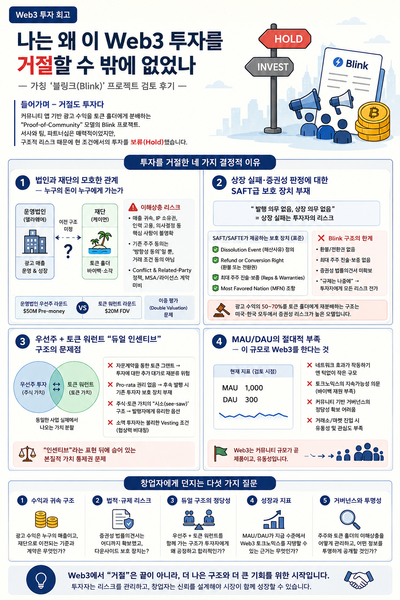

# 나는 왜 이 Web3 투자를 거절할 수 밖에 없었나

*가칭 **블링크(Blink)** 프로젝트 검토 후기와, Web3 창업자에게 드리는 다섯 가지 질문*

**Dennis Kim** · Betalabs Inc. CEO · Web3 Investor
2026년 5월 9일

> 🇺🇸 **English version:** [Why I Declined This Web3 Investment](./Why_I_Declined_This_Web3_Investment_EN.md)
> 📄 **PDF version (Korean):** [나는_왜_이_Web3_투자를_거절할_수_밖에_없었나_블링크_포스트모템.pdf](./나는_왜_이_Web3_투자를_거절할_수_밖에_없었나_블링크_포스트모템.pdf)

---

## 들어가며 — 거절도 투자다

최근 한 Web3 프로젝트—이 글에서는 "블링크(Blink)"라 부르겠다—의 투자 검토를 진행했고, 결과적으로 현 조건에서의 투자는 보류(Hold)하기로 결정했다. 블링크는 실제로 운영 중인 커뮤니티 앱을 기반으로 광고 수익을 토큰 홀더에게 분배하는 "Proof-of-Community" 모델을 표방하는, 서사(narrative) 자체로는 매력적인 프로젝트였다. 팀에는 글로벌 크립토 미디어와 결제 인프라 출신이 합류해 있다고 했고, MOU 파트너 명단에도 실존 브랜드들이 다수 포함되어 있었다.

**그럼에도 거절했다.** 이 글은 그 결정의 배경을 정리한 포스트모템(post-mortem)이다. 특정 프로젝트를 깎아내리려는 글이 아니라, 한국·아시아의 많은 Web3 창업자들이 비슷한 구조와 비슷한 함정을 반복하고 있기 때문에, 그리고 나 또한 비슷한 구조의 프로젝트를 자문하면서 같은 질문을 반복적으로 던지고 있기 때문에 한 번쯤 정리할 가치가 있다고 판단했다.

Web3 라운드에서 "거절"은 단순히 "아니오"가 아니다. VC가 무엇을 보고 있는지, 어떤 구조적 결격이 딜을 무산시키는지를 창업자에게 알려주는 신호다. 본 회고에서 다루는 네 가지 결격 사유는 다음과 같다.

- **첫째** — 법인과 재단의 모호한 관계, 기존 주주와 재단(=토큰 홀더) 사이의 이해상충
- **둘째** — 상장 실패·증권성 판정 등 다운사이드에 대한 SAFT/SAFTE 수준의 계약적 보호 부재
- **셋째** — 우선주 투자에 토큰 워런트를 인센티브로 끼워주는 듀얼 구조의 본질적 문제점
- **넷째** — MAU/DAU의 절대적 부족: 이 규모로 Web3를 한다는 것이 어떤 의미를 갖는가?

---

## 1. 법인과 재단의 모호한 관계 — "누구의 돈이 누구에게 가는가"

### 1.1 듀얼 엔티티의 함정

블링크는 전형적인 "델라웨어 운영법인 + 케이먼 토큰 재단"의 듀얼 엔티티 구조를 채택하고 있었다. 이 구조 자체는 Web3 업계의 표준에 가까우며, Mysten Labs/Sui, Solana, Aptos 등 주요 프로토콜이 모두 유사한 형태를 사용한다. 문제는 구조가 아니라 **"양 엔티티 사이의 계약"**이 공개되지 않았다는 점이다.

내가 검토 과정에서 던진 핵심 질문은 단순했다. "광고주가 지불하는 1달러는 누구의 매출로 잡히고, 어느 단계에서 어떤 계약을 통해 재단으로 흘러가며, 결국 토큰 바이백·소각의 재원이 되는가?" 이 질문에 대해 받은 답은 "아직 구체화되지 않았다" 그리고 "법적 검토가 더 필요하다"였다. 이는 결격 사유였다.

### 1.2 기존 주주와 재단 사이의 이해상충 지점

듀얼 엔티티 구조에서 "주식 투자자"와 "토큰 홀더"는 종종 같은 회사의 가치를 두고 경쟁하는 관계가 된다. 광고 수익이 운영법인 매출로 잡힌다면 주식 가치가 오르고, 같은 매출이 재단으로 이전돼 토큰 바이백에 쓰인다면 토큰 가치가 오른다. 양쪽 사이의 "이전가격(transfer pricing)"과 "라이선스 수수료"가 어떻게 책정되는가에 따라 한쪽이 일방적으로 손해를 본다.

| 쟁점 | 주식 투자자(델라웨어) 입장 | 토큰 홀더(케이먼 재단) 입장 |
|---|---|---|
| 광고 매출 귀속 | 운영법인 직접 수취 → 주식가치 상승 | 재단 이전 → 바이백·소각 재원 |
| 핵심 IP 소유권 | 델라웨어 보유 + 라이선스 수익 | 재단 사용권만 보유, 라이선스 취소시 가치 붕괴 |
| 핵심 인력 고용 | 델라웨어 직접 고용 | 재단은 "껍데기", 실질 경영 부재 시 sham 판정 리스크 |
| 의사결정 | 이사회 결정 | 토큰 거버넌스는 자문적 수준에 그칠 가능성 |
| 동일 평가액 이중 라운드 | $50M Pre-money 우선주 라운드 | $20M FDV 토큰 워런트 라운드 |

블링크의 경우, 운영법인 우선주 라운드는 $50M Pre-money로, 토큰 라운드는 $20M FDV로 설정되어 있었다. "주식과 토큰을 묶어서 인센티브로 부여한다"는 설명을 들었지만, 같은 실체(business)에 대해 두 개의 평가액이 동시에 존재한다는 점은 이중평가(double valuation) 문제로 직결된다. 양 엔티티 간의 라이선스·용역계약·자금이전 약정이 명문화되지 않은 상태에서, 어느 쪽 투자자가 우선권을 갖는지 결정해 줄 장치가 없다.

### 1.3 기존 주주 동의의 한계

창업자는 "기존 주주 120명에게 토큰 사업 추진을 공지했고 동의를 받았다"고 했다. 이는 절차적 정당성으로는 의미가 있지만, 법적·경제적 보호 장치로는 부족하다. 동의의 시점에서 토큰의 발행조건·분배비율·재단 이전 구조가 확정되어 있지 않았다면, 그 동의는 "방향성에 대한 동의"일 뿐 "거래 조건에 대한 동의"가 아니다. 후속 라운드에서 토큰 보유 비율이 변하거나 광고 매출의 재단 이전이 늘어나면, 기존 주주는 자신이 동의하지 않은 가치 이전(value transfer)을 사후적으로 떠안게 된다.

결론적으로, "이해상충 절차는 아직 구성 전"이라는 답변은 그 자체로 투자 거절 사유가 된다. Conflict of Interest Policy, Related-Party Transaction Policy, 양 엔티티 간 MSA(Master Services Agreement)와 IP License Agreement는 펀딩 이전에 초안 수준이라도 존재해야 한다.

---

## 2. 상장 실패·증권성 판정에 대한 SAFT급 보호 장치 부재

### 2.1 "발행 의무 없음, 상장 의무 없음"의 실질적 의미

블링크가 제시한 토큰 워런트 계약의 핵심 조항은 "토큰을 발행할 의무는 없으며, 상장 또한 동일하다"는 것이었다. 발행 시 FDV 대비 지분율은 보장하지만, 발행 자체가 일어나지 않으면 보장의 객체가 사라진다. 이는 발행자에게는 합리적이지만, 투자자 입장에서는 "대가는 미리 지불하고, 결과는 발행자가 결정하는" 비대칭 구조다.

일반적인 SAFT(Simple Agreement for Future Tokens) 또는 SAFTE(Simple Agreement for Future Tokens or Equity)는 이런 비대칭을 다음과 같은 장치로 보완한다.

- **Dissolution Event(해산사유) 정의** — 일정 기간 내 토큰이 발행되지 않거나, 미국·한국 규제당국이 증권성을 판정하거나, 핵심 인력(Key Person)이 이탈하면 자동으로 해산 사유가 발생한다.
- **Refund or Conversion Right(환불 또는 전환권)** — 해산 사유 발생 시 투자금의 원금 환불 또는 운영법인 보통주/우선주로의 전환권이 작동한다.
- **최대 주주 진술·보증(Reps & Warranties)** — 발행자 측 최대 주주 또는 핵심 창업자가 "발행을 위한 합리적 노력을 다한다", "알려진 규제 리스크가 없다" 등의 진술을 하고 위반 시 손해배상 책임을 진다.
- **Most Favored Nation(MFN) 조항** — 후속 라운드에서 더 유리한 조건이 제시되면 자동 적용된다.

### 2.2 환불 조항의 본질 — 다운사이드 보호의 비대칭성

내가 **"상장 부적격 등 문제가 발생할 경우 최대 주주의 진술·보증과 환불 조항이 가능한가"**를 물었을 때 받은 답은 "현재는 토큰 발행 시 워런트 계약에 한정된다"였다. 이는 사실상 "상장 실패는 투자자의 리스크"라는 의미다.

자본시장의 다른 영역, 예컨대 IPO 인수계약·신주발행·전환사채 등에서는 상장 실패·발행 실패 시 환매·이자 가산 등의 다운사이드 보호가 표준 조항으로 들어간다. Web3 토큰 라운드만 유독 "발행자가 모든 옵션을 쥐는" 구조가 정당화될 이유는 없다.

게다가 블링크의 경우 미국·한국 어느 곳에서도 증권성 평가 법률의견서(legal opinion)를 확보하지 않았다. "증권성은 감당이 안 된다"는 답변은 솔직하지만, VC 입장에서는 "규제 리스크를 투자자에게 떠넘기는 구조"로 읽힌다. 한국 자본시장법상 투자계약증권 해석은 2024년 이후 공격적으로 확대되고 있고, 미국 SEC의 Howey Test 적용 또한 여전히 살아 있다. 광고 수익의 50~70%를 토큰 홀더에게 재분배하는 구조는 두 기준 모두에서 위험 신호를 켠다.

### 2.3 "규제는 나중에"가 아닌 이유

"규제는 나중에 챙기겠다"는 입장은 시드 단계에서는 이해 가능하지만, 토큰 워런트를 발행하고 외부 투자자의 자금을 받는 순간부터는 이미 "나중"이 아니다. Tier-1 미국 로펌(Cooley, Fenwick, Gunderson, DLA Piper 등)의 의견서는 비용이 들지만, 이 의견서 없이 들어온 투자자는 "규제 판정에 따른 모든 다운사이드를 본인이 떠안는" 구조에 동의하는 셈이다. 합리적인 LP 자금을 가진 VC라면 이 위험을 허용할 수 없다. 그래서 "레귤레이션을 지켜야 VC가 들어온다"는 말은 권고가 아니라 거의 필요조건이다.

---

## 3. 우선주 + 토큰 워런트 "듀얼 인센티브" 구조의 문제점

### 3.1 "자문계약을 통한 토큰 그랜트"의 함정

블링크가 제시한 구조는 다음과 같았다. 운영법인 우선주에 $50K 이상 투자하면, 별도 자문계약·컨설팅 계약을 통해 토큰 워런트가 인센티브로 부여된다. 표면적으로는 "주식+토큰 듀얼 익스포저"처럼 보이지만, 실질을 들여다보면 다음 문제가 드러난다.

- **"자문계약"의 가치 산정** — 투자자가 실제로 자문 용역을 제공하지 않거나 그 대가가 시장가격을 벗어나면, 미국·한국 모두에서 "투자에 대한 추가 대가"로 재분류될 수 있다. 이는 증권성 판단을 강화하는 요소가 된다.
- **Pro-rata 권리 부재** — 창업자는 명시적으로 "코인에 대한 Pro-rata 권리는 없다"고 했다. 후속 토큰 라운드에서 더 유리한 조건이 나와도 기존 우선주 투자자는 follow-on할 권리가 없다. 이는 일반적인 우선주 라운드의 Pro-rata 권리와 정면으로 충돌한다.
- **주식·토큰 가치의 "시소(see-saw)"** — 앞서 1장에서 설명한 듀얼 엔티티 구조에서 양쪽 가치는 종종 반비례한다. 듀얼 익스포저는 헷지가 되는 듯 보이지만, 실제로는 "어느 쪽이 더 큰 가치를 받을지"를 발행자가 사후적으로 결정할 수 있는 권한을 가진다.
- **Vesting 협상의 비대칭** — "규모 있는 투자가 들어오면 vesting plan을 협상한다"는 답변은 "소액 투자자는 표준 조건을 받는다"는 의미다. 즉 락업 12개월 + 베스팅 24개월 + 상장 시 10% 해제라는 시장 평균보다 불리한 조건이 소액 투자자에게는 그대로 적용된다.

### 3.2 "인센티브"라는 단어의 위험성

토큰을 "인센티브" 또는 "보너스"로 표현하는 순간, 투자자는 그것을 부수적 가치로 인식하기 쉽다. 그러나 실제 투자 판단은 "주식 가치 + 토큰 가치"의 합산 기대값으로 이뤄지며, 두 가치가 모두 동일한 사업 실체(business)에서 나온다는 점에서 이는 단순한 "보너스"가 아니라 본질적 가치 분할이다.

후속 토큰 발행이 일어날 때 기존 우선주 투자자가 자신의 토큰 워런트가 희석되는 것을 막을 장치가 없다면, "인센티브"라는 표현은 결국 "발행자가 언제든 회수할 수 있는 옵션"이라는 의미가 된다. 이는 우선주 투자자의 진정한 다운사이드를 가린다.

### 3.3 권고 — 듀얼 구조가 작동하려면

듀얼 인센티브 구조 자체를 부정할 필요는 없다. 다만 다음 장치가 동반되어야 한다.

- **Side Letter** — 우선주 투자자에게 후속 토큰 라운드에서의 Pro-rata 권리, MFN, 정보권을 명시
- **Token Warrant 표준화** — 모든 우선주 투자자에게 동일한 비례식 토큰 할당, 같은 베스팅 일정 적용
- **Economic Rights Agreement** — 운영법인과 재단 사이의 매출·라이선스·바이백 재원 흐름을 문서화하여 우선주·토큰 양쪽 투자자에게 공개
- **Key Person 트리거** — 핵심 창업자·CTO 이탈 시 락업 조기 해제 또는 환매 옵션

---

## 4. MAU 1천 — 이 규모에서 Web3가 무슨 의미를 갖는가?

### 4.1 광고 네트워크의 임계 규모

블링크의 핵심 토큰 효용은 "광고 수익의 분배"다. 즉, 광고주가 광고비를 집행하고, 그 수익이 커뮤니티 기여자들에게 토큰 형태로 분배되는 구조다. 이 구조가 의미를 가지려면 "유의미한 광고주"가 들어와야 하고, 유의미한 광고주는 유의미한 트래픽을 요구한다.

디지털 광고 업계에서 유료 광고 네트워크가 "자체 매출"을 발생시키기 시작하는 임계는 통상 수백만 MAU 단위다. Brave/BAT가 의미 있는 광고 매출을 내기 시작한 시점은 MAU 수천만 대였고, Reddit·X 모두 수천만 단위에서 광고 비즈니스가 작동하기 시작했다. 창업자 본인도 "1,000만 명 이상은 되어야 작동이 유의미하다"고 인정했다.

문제는 현재 MAU가 1천명이라는 점이다. 1,000만에 도달하려면 폭발적인 성장이 필요하다. 그 사이의 비용 구조·CAC·retention·전환율 데이터는 제시되지 않았다. 토큰 인플레이션 곡선이 WAU 성장에 완전히 종속된 상태에서, WAU 가정이 빗나가면 인플레이션은 바로 두 자릿수로 튀어 오른다.

### 4.2 이용자당 평가액의 비교 — "프리미엄"은 무엇으로 정당화되는가?

$20M 평가액 ÷ MAU 1천명 = 이용자당 2만 달러. 비교하자면, Reddit IPO 시점의 이용자당 가격은 $8~$43 수준이었고, Discord의 후기 라운드 추정치는 이용자당 $100 내외였다. Web3 프리미엄과 토큰 이코노미 프리미엄을 감안해도, 이용자당 Reddit보다 어마어마한 프리미엄이 붙는다.

이 프리미엄을 정당화하려면 "왜 우리 유저 1명이 Reddit 유저 수백 명만큼의 가치가 있는가"에 대한 데이터 기반 설명이 필요하다. 객단가, ARPU, retention(D7/D30), LTV/CAC, 광고주 LOI/파일럿 매출 — 어느 하나라도 제시되어야 한다. 블링크는 이중 어떤 것도 제시하지 않았다. "아직 공식 론칭 전", "6월 VidCon 이후 미국 론칭"이라는 답변뿐이었다.

### 4.3 "Web3로 가면 다르다"는 가정의 검증

창업자가 비교 대상으로 제시한 Whop, Patreon, Substack, Kajabi는 모두 의미 있는 매출(MRR)이 발생하는 단계에서 $50M~$100M 가치평가를 받았다. 이들 회사의 공통점은 "Web3" 요소가 없거나 매우 약하다는 것이다. 즉 가치평가는 토큰 이코노미 때문이 아니라 사업 자체의 매출과 retention 때문에 발생했다.

"Web3로 가면" 추가되는 가치는 (a) 토큰 자체의 투기적 수요, (b) 커뮤니티 기여자들에게 직접 보상함으로써 발생하는 retention boost, (c) 글로벌 결제·정산 인프라의 단순화 정도다. 이들 효과는 모두 일정 규모 이상에서 작동하는 "승수(multiplier)" 성격이다. 승수의 기반인 절대 규모(MAU)가 작으면 곱해도 결과는 작다. **0에 100을 곱해도 0이다.**

정직하게 말하자면, MAU 1천명 단계의 사업이 "Web3로 갈 가치"를 갖는 경우는 두 가지뿐이다. 첫째, 이미 강력한 retention과 단가가 있어서 "Web3 결제·정산" 자체가 비용 절감을 일으키는 경우(B2B SaaS형). 둘째, 글로벌·지역 분산 사용자 풀이 핵심이라서 토큰이 결제 수단으로 직접 작동하는 경우(예: 송금·게임 인게임 자산). 블링크는 이 둘 어느 쪽에도 명확히 해당하지 않았다.

### 4.4 결국 "먼저 Web2를 증명하라"

이는 블링크에 국한되지 않는 한국 Web3 스타트업의 공통적 패턴이다. "Web3 토큰 이코노미"를 사업 부진의 우회로로 사용하려는 시도가 적지 않다. 그러나 토큰 이코노미는 사업의 부진을 우회하는 도구가 아니라 "이미 작동하는 사업"의 가치를 더 효율적으로 분배·증폭하는 도구다. MAU·ARPU·retention이 작동하지 않는 사업에 토큰을 얹는 것은, 새는 양동이에 더 큰 호스를 연결하는 것과 같다.

그래서 내가 마지막으로 권고한 것은 **"블링크의 Web2 매출과 retention을 먼저 증명하라"**였다. MAU 10만 + 실거래 광고주 5개 + 누적 광고매출 $100K가 90일 안에 관찰되면, 그 시점에서의 토큰 라운드는 훨씬 다른 협상 위치를 갖는다. 그 전까지 $20M FDV는 방어되기 어렵다.

---

## 5. 마치며 — Web3 창업자에게 드리는 다섯 가지 질문

이 회고를 마치며, 블링크와 비슷한 단계의 Web3 창업자들이 다음 라운드를 시작하기 전에 스스로에게 던져야 할 다섯 가지 질문을 정리한다.

**1. 양 엔티티의 계약.** 운영법인과 토큰 재단 사이의 IP·매출·라이선스·바이백 재원 흐름이 한 장의 다이어그램과 한 부의 계약서로 설명 가능한가? "법적 검토 중"은 답이 아니다.

**2. 다운사이드 보호.** 토큰 발행 실패·상장 실패·증권성 판정 시 투자자가 회수 가능한 경로가 계약에 명시되어 있는가? SAFT/SAFTE 표준 조항이 어디까지 도입되어 있는가?

**3. 규제 자세.** 미국·한국 증권성 법률의견서가 없다면, 그 부재의 비용을 누가 부담하는가? "증권성은 감당이 안 된다"가 솔직한 답이라면, 그 솔직함을 투자자도 공유해야 한다.

**4. 듀얼 인센티브의 진정한 비용.** 주식 + 토큰 워런트 구조에서 후속 라운드의 Pro-rata, MFN, 정보권, Key Person 조항이 모두 표준화되어 있는가? "규모 있는 투자에 한해 협상 가능"은 소액 투자자에게는 "협상 불가"를 의미한다.

**5. Web2 증명.** MAU·ARPU·retention·광고주 파이프라인이 토큰 이코노미를 정당화하는 절대 규모에 도달했는가? Web3는 작동하는 사업의 분배 효율을 높이는 도구이지, 작동하지 않는 사업의 우회로가 아니다.

---

거절은 결론이 아니라 협상의 시작이다. 위 다섯 가지가 보강된 시점에서 블링크는 다시 검토 테이블에 올라올 수 있고, 그때의 평가액은 시장이 인정할 수 있는 수준일 것이다. 그것이 창업자에게도, 투자자에게도, 토큰 홀더 커뮤니티에도 가장 좋은 결과다.

이 글이 비슷한 단계의 Web3 창업자들에게 "VC가 무엇을 보고 있는가"에 대한 거울이 되기를, 그리고 비슷한 단계의 투자자들에게는 "거절의 프레임워크"가 되기를 바란다.

---

**Dennis Kim (김호광)**
Betalabs Inc. CEO · Web3 Investor
전 Cyworld Z 대표 · Microsoft Azure MVP

---

> *※ 본 회고는 특정 프로젝트의 평판을 손상시킬 의도가 없으며, 회사명·서비스명은 **"블링크(Blink)"**로 가명 처리했다. 본문은 투자 권유·매수 추천·법률·세무·재무 자문을 구성하지 않으며, 회고적 분석으로서 일반적 학습 자료로만 활용되어야 한다.*
