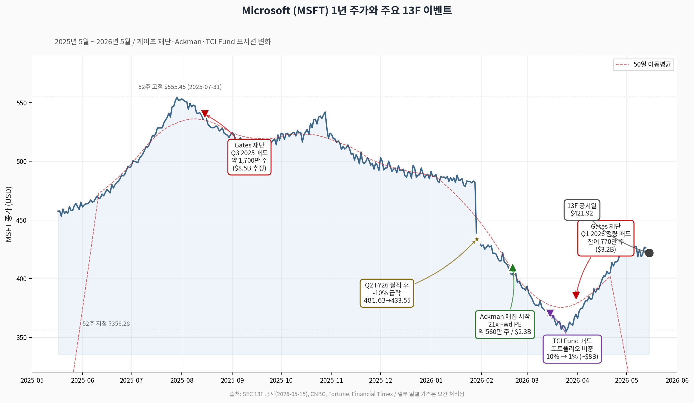

# 빌 게이츠 재단의 MSFT 전량 매도, 어떻게 읽어야 하나?

**퀀트 신호와 헤지펀드 양극단의 베팅**

*Dennis Kim (김호광) · vibe-investing · 2026-05-17*

---

## 한 줄 요약

빌 & 멜린다 게이츠 재단 트러스트의 이번 마이크로소프트(이하 'MSFT') 지분 전량 정리는, 기업 펀더멘털이나 미래 전망에 대한 부정적 신호라기보다 20년 청산 로드맵에 맞춘 사전 계획된 자산 운용으로 해석된다. 다만 같은 시점에 헤지펀드 진영의 베팅은 정반대로 갈렸다. 한쪽은 "21배 선행 PER, 명백한 저평가"라며 신규 매수, 다른 쪽은 "AI가 오피스·애저를 위협한다"며 익절. 운영 중인 AMQS-M7 퀀트 모델도 동일 시점 MSFT를 위성 포지션 수준의 점수로 평가하고 있다.

## 핵심 인포그래픽 · MSFT 1년 주가와 13F 이벤트

*[Figure 1] MSFT 종가 추이 (2025-05 ~ 2026-05) 및 주요 헤지펀드/재단 포지션 이벤트. 52주 고점 $555.45 (2025-07-31) → 52주 저점 $356.28 (2026-03) → 현재 $421.92.*

---

## 1. 매각 개요 — 13F가 확인한 '0주'

게이츠 재단 트러스트는 2026년 5월 15일 SEC에 제출한 13F를 통해, 2026년 1분기 중 남은 마이크로소프트 770만 주(약 32억 달러, 한화 약 4조 6,700억 원)를 전량 매도했다고 공시했다. 1년 전인 2025년 1분기 말 기준 트러스트는 약 2,850만 주(107억 달러, 포트폴리오의 26%)를 보유하고 있었으나, 2025년 3분기 중 약 65%에 해당하는 1,700만 주를 처분한 데 이어, 이번 분기에 잔여 지분을 모두 정리해 보유량을 '0'으로 만들었다.

- **트러스트 전체 포트폴리오 규모:** 약 317억 달러
- **트러스티(수탁자):** 빌 게이츠 본인 (운용은 Cascade Asset Management)
- **빌 게이츠 개인 보유분은 별개:** 약 1억 300만 주, 약 430억 달러 규모는 여전히 유지

핵심은 트러스트의 '0주'이지, 게이츠 본인이 마이크로소프트를 떠난 것은 아니라는 점이다.

## 2. 왜 팔았나? — '자선 청산 계획'과 '집중 위험 해소'

게이츠는 2024년 재단을 2045년경까지 청산하고 사망 시까지 누적 2,000억 달러 이상을 기부하겠다는 계획을 발표한 바 있다. 이를 위해 매년 약 90억 달러 규모의 그랜트(grant)를 집행해야 하며, 단일 종목 — 그것이 아무리 우량할지라도 — 에서 이 정도 현금흐름을 매년 안정적으로 뽑아내기 어렵다.

서구 매체 다수는 이번 매도의 동인을 세 가지로 정리한다.

- **집중 위험(Concentration Risk) 해소:** 창업자 종목이라는 정서적 애착보다 자선 미션 수행 의무가 우선한다.
- **밸류에이션 합리화 구간의 차익실현:** 마이크로소프트는 장기간 강세를 보였고, 일부 차익을 굳히는 것은 정상적 포트폴리오 운용이다.
- **유동성 확보:** 연간 수백억 달러 그랜트 집행을 위해서는 단일 주식이 아닌 분산된 현금성 자산이 필요하다.

요컨대 이번 매각은 개별 종목 매도 신호라기보다 **"초대형 기관의 청산 일정에 따른 자산 재분배"**에 가깝다. 즉, 자선 사업 계획에 따른 최적 타이밍의 이익 실현이다.

## 3. 시장은 둘로 갈렸다 — Ackman vs. Hohn

흥미로운 부분은 같은 가격대 마이크로소프트를 두고 헤지펀드 거장 두 명이 정반대 베팅을 했다는 점이다.

### 강세 측 · 빌 애크먼 (Bill Ackman, Pershing Square)

- 같은 5월 15일 공개된 13F에서 MSFT 약 560만 주, 약 23억 달러 규모 신규 매수 공시
- 2026년 2월 MSFT의 Q2 실적 발표 후 약 10% 급락 구간부터 매집 시작
- "선행 PER 약 21배는 시장 평균과 거의 같고, 마이크로소프트 최근 수년 평균 대비로는 명백히 낮다"며 핵심 포지션(core holding)으로 분류
- OpenAI 지분(약 27% 경제적 권리, 약 2,000억 달러 가치)이 시총에 반영되지 않았다고 주장
- 자금 출처는 알파벳(Alphabet) 매도. 토요일 별도 게시물에서 구글 모회사 주식 매도로 MSFT 매수 자금을 충당했다고 밝힘
- 1,900억 달러 규모의 2026년 캐펙스 우려에 대해서는 "J 커브 성장 투자이지 마진 위협이 아니다"로 일축

### 약세 측 · 크리스 혼 (Chris Hohn, TCI Fund Management)

- 같은 분기, TCI는 MSFT 비중을 포트폴리오의 약 10%에서 1%로 대폭 축소, 약 80억 달러 규모를 정리
- 매도 논리: "AI의 급속한 발전이 오피스(Microsoft 365)와 애저(Azure)의 장기 경쟁 우위를 위협한다" — AI가 기존 SaaS·클라우드 해자를 잠식한다는 견해
- 빠진 자금은 알파벳 비중 확대(약 5%)로 회전. 흥미롭게도 애크먼이 매도한 종목

같은 종목, 같은 가격대, 정반대 결론. "AI 시대의 승자가 MSFT인가 GOOGL인가"라는 본질적 논쟁이 두 펀드의 13F에 그대로 박혀 있다.

## 4. 펀더멘털 점검 — 펀드들이 보고 있는 숫자

| 지표 | MSFT 값 |
| --- | --- |
| TTM 매출 | 약 2,810억 달러 |
| TTM 영업이익 | 약 1,490억 달러 |
| 현금 및 유가증권 | 780억 달러 이상 |
| TTM 잉여현금흐름 | 730억 달러 이상 |
| Azure 성장률 (FY26 Q3) | +39% (constant currency) |
| 2026 YTD 주가 수익률 | 약 -11% (7월 고점 대비 -26%) |
| 선행 PER (Forward) | 약 21배 (Alphabet 28x / Amazon 32x / Apple 33x) |
| TTM PER vs. 5년 중위값 | 약 25배 vs. 약 34배 |
| GF Value 평가 (GuruFocus) | 약 23% 저평가, GF Score 95/100 |

밸류에이션 멀티플만 보면, 애크먼이 **"마이크로소프트는 빅테크 중 상대적으로 가장 싸다"**고 말하는 데 이론적 근거가 있다.

## 5. AMQS-M7 퀀트 신호와의 정합성

운영 중인 AMQS-M7(Adaptive Momentum Quant Strategy for Magnificent 7)도 최근 스냅샷에서 MSFT를 다음과 같이 평가하고 있다.

| 지표 | MSFT 값 |
| --- | --- |
| 12-1 모멘텀 | +28.5% (장기 추세 유지) |
| 6-1 모멘텀 | +12.1% (중기 추세 유지) |
| 3-1 모멘텀 | +5.4% |
| 52주 신고가 거리 | -0.5% |
| RSI | 58 (중립) |
| 종합 점수 | 78.2 / 100 |
| 목표 비중 | 18.3% (위성 포지션) |
| 신호 | [+] Satellite |

AMQS-M7은 M7 종목군에 한해 (1) 4-Factor 모멘텀 + (2) Pullback-in-Uptrend 단기 하락 매수 차원 + (3) 거시 레짐 필터(QQQ 200MA·VIX) + (4) -12% 손절을 결합하는 시스템이다. 모델 관점에서 현재 MSFT는 장·중기 추세는 유지된 채 멀티플만 압축된 상태 — 즉 추세 붕괴가 아닌 멀티플 디레이팅(de-rating) 국면으로 분류된다. 이는 애크먼이 **"21배 선행 PER, 시장 평균 대비 명백한 저평가"**라고 표현한 구간과 정확히 같은 자리다.

다만 모델은 MSFT를 핵심(core)이 아닌 위성(satellite) 18.3%에 배치한다. 이유는 단순하다: 같은 M7 안에서 NVDA 등 단기 하락 매수 신호가 더 강하게 활성화된 종목이 있고, M7 7개가 모두 빅테크 단일 섹터 베타에 노출되므로 한 종목에 과도하게 집중하지 않는다는 사전 필터 때문이다. "MSFT가 싸다"와 "MSFT만 사야 한다"는 다른 문제라는 점은 게이츠 재단의 집중 위험 해소 논리와도 결을 같이한다.

## 6. 일반 투자자 관점 — 무엇을 봐야 하나?

이번 일련의 13F 공시는 한국 서학개미 입장에서 다음 세 가지를 시사한다.

- **'창업자가 팔았다'는 헤드라인은 1차 정보일 뿐이다.** 게이츠 재단 매도의 본질은 자선 청산 일정(20년 와인드다운)과 유동성 의무이며, 게이츠 개인은 여전히 약 430억 달러어치 마이크로소프트 주식을 보유하고 있다.
- **같은 가격대를 두고 펀드 거장들의 의견이 갈린다는 사실 자체가 시장 정보다.** 애크먼은 "OpenAI 27% 권리 미반영 + 21배 PER"을, 혼은 "AI에 의한 오피스·애저 해자 잠식"을 각각 핵심 변수로 본다. 둘 중 누가 맞느냐는 Azure 성장률 둔화 여부와 M365 Copilot 유료 전환율로 향후 4~6개 분기에 갈릴 가능성이 높다.
- **퀀트 시그널과 펀더멘털 내러티브가 동일한 방향을 가리킬 때 — 즉 모멘텀은 유지된 채 멀티플만 압축된 구간 — 는 일반 투자자에게도 분할 매수의 합리적 근거가 된다.** 다만 단일 종목 집중이 아닌 분산 보유, -12% 룰 같은 명시적 손절 기준, 그리고 빅테크 단일 섹터 베타에 대한 인지가 함께 가야 한다.

---

## 참고 자료 (References)

1. **Stocktwits** — "Bill Gates' Foundation Sells Last Of Microsoft" (2026-05-15)
   <https://stocktwits.com/news-articles/markets/equity/bill-gates-foundation-sells-last-of-microsoft/cZXVn6yRekK>
2. **24/7 Wall St.** — "Bill Gates Just Did the Unthinkable — He Sold Every Last Share of Microsoft Stock" (2026-05-16)
   <https://247wallst.com/investing/2026/05/16/bill-gates-just-did-the-unthinkable-he-sold-every-last-share-of-microsoft-stock/>
3. **CoinCentral** — "Microsoft (MSFT) Stock: Gates Foundation Sells Last of Its $3.2B Stake — Here's Why"
   <https://coincentral.com/microsoft-msft-stock-gates-foundation-sells-last-of-its-3-2b-stake-heres-why/>
4. **Parameter** — "Gates Foundation Trust Completes $3.2B Microsoft (MSFT) Exit in Q1 2026"
   <https://parameter.io/gates-foundation-trust-completes-3-2b-microsoft-msft-exit-in-q1-2026/>
5. **CNBC** — "Ackman's Pershing Square takes stake in Microsoft, citing 'compelling' valuation" (2026-05-15)
   <https://www.cnbc.com/2026/05/15/ackmans-pershing-square-takes-stake-in-microsoft.html>
6. **Fortune** — "Bill Ackman has been quietly buying Microsoft since February" (2026-05-15)
   <https://fortune.com/2026/05/15/bill-ackman-microsoft-stock-openai-azure-spending/>
7. **Benzinga** — "Bill Ackman Buys Microsoft Stock, Calls It Compellingly Cheap"
   <https://www.benzinga.com/markets/prediction-markets/26/05/52601186/bill-ackman-buys-microsoft-stock-calls-it-compellingly-cheap>
8. **BigGo Finance / Financial Times** — "Billionaire Hohn Dumps $8 Billion Microsoft Stake, Betting on Google in AI Shift"
   <https://finance.biggo.com/news/p_GgCJ4BX0tZvRTv0D03>
9. **CNBC** — "Microsoft Q2 earnings report 2026" (2026-01-28)
   <https://www.cnbc.com/2026/01/28/microsoft-msft-q2-earnings-report-2026.html>
10. **CNBC** — "Microsoft Q3 earnings report 2026" (2026-04-29)
    <https://www.cnbc.com/2026/04/29/microsoft-msft-q3-earnings-report-2026.html>
11. **GuruFocus** — "Bill Gates' Charity Sells Microsoft's Shares" (2026-05-16)
    <https://www.gurufocus.com/news/8865491/bill-gates-charity-sells-microsofts-shares-impacting-msft-holdings>
12. **Macrotrends** — Microsoft Stock Price History
    <https://www.macrotrends.net/stocks/charts/MSFT/microsoft/stock-price-history>
13. **Dennis Kim** — AMQS-M7: Adaptive Momentum Quant Strategy for Magnificent 7, vibe-investing repository
    <https://github.com/gameworkerkim/vibe-investing/tree/main/01.Trading%20Strategy/Adaptive%20Momentum%20Quant%20Strategy%20(AMQS)%20for%20M7>

---

*본 칼럼은 정보 제공 목적이며 매수·매도 권유가 아닙니다. 13F는 공시 시점 이전 분기말 기준 보유 현황이며, 실제 거래 시점과 시차가 있다는 점을 유의해 주세요. 차트의 일부 일별 가격은 보도된 주요 지점을 기반으로 보간 처리되었습니다.*
