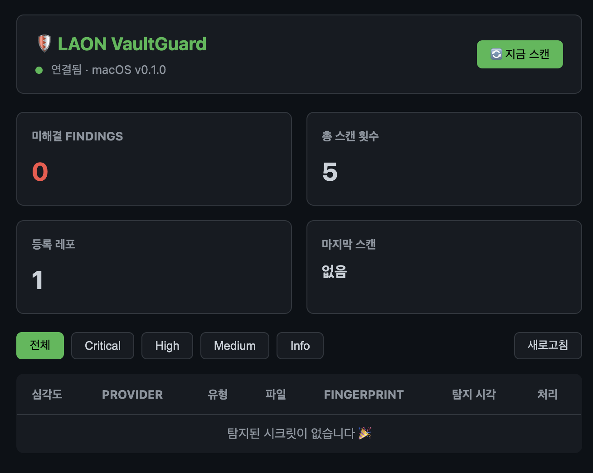

# LAON VaultGuard

> **LLM-based Automated Observer for Non-public Keys**
>
> A cross-platform security auditing platform that periodically monitors Git repositories on developer machines and team environments to prevent cloud private keys (AWS, Azure, GCP, KT Cloud, Naver Cloud) from being exposed.

[한국어](./README.md) | English | [中文](./README_ZH.md) | [日本語](./README_JA.md)

## Why LAON VaultGuard

**In June 2026, Tving accidentally exposed an AWS access token hardcoded in a public GitHub repository** — proving once again that a single mistake can put an entire infrastructure at risk. Regex-based scanners like `gitleaks` and `trufflehog` are fast but blind to context. LLMs, on the other hand, can detect secrets by "meaning" — even when variable names are generic or keys are assembled from parts.

However, **depending on a single LLM is another single point of failure**. Each model has its own biases, and an API outage or quota exhaustion creates a detection gap. LAON VaultGuard is designed for **cross-validation across multiple LLMs**:

- **Each LLM forms a distinct security persona** — Claude (discipline-oriented), DeepSeek (high-performance, low-cost), GPT (systematic), MiniMax (lightweight, fast)
- **Majority-vote mode** reduces false positives, and **sequential fallback** ensures scans never stop due to a single LLM failure
- A critical link in the 4-gate defense: [Gitleaks](https://github.com/gitleaks/gitleaks) (pre-commit) → **LAON VaultGuard** (periodic audit) → [TruffleHog](https://github.com/trufflesecurity/trufflehog) (CI) → GitHub Secret Scanning (post-push)

Regex handles speed. LLMs handle context. **Use both, for real stability.**

## Features

- **Periodic repo monitoring** — cron-based scheduler for GitHub, GitLab, and local repos
- **Multi-LLM detection** — OpenAI (ChatGPT), DeepSeek, MiniMax, Mimo, **Ollama (local)** with concurrent cross-validation
- **Offline mode** — fully local secret detection via Ollama, no internet or API key required
- **Two-stage detection** — Stage 1: `git grep` keyword filter → Stage 2: LLM contextual analysis to minimize false positives
- **Web dashboard** — local web UI with SSE real-time updates, accessible to the team on the same network
- **Multi-channel alerts** — Slack, Telegram, Email, and Dashboard notifications
- **Cross-platform** — macOS, Linux, Windows (WSL)

### Extended Security Scanning (v0.3+)

Beyond cloud key detection, additional vulnerability categories are audited:

| Category | Detection |
|---|---|
| SQL Injection | Query string concatenation, `rawQuery`, `db.execute()`, missing PreparedStatement |
| DB Credential Exposure | `jdbc:`, `mongodb://`, `redis://`, `DATABASE_URL`, plaintext `DB_PASSWORD` |
| TLS/SSL Misconfig | `rejectUnauthorized: false`, `NODE_TLS_REJECT_UNAUTHORIZED=0`, `insecure=true` |
| Outdated Versions | OpenSSL 0.x/1.0, TLSv1.0, Apache 2.2, PHP 5.x/7.0-3, MySQL 5.0-6, WordPress 1-5 |

### Test Methods

**Method 1: CLI (quick single scan)**

```bash
# Full scan
npx laon-vaultguard scan .

# Category-specific scan
npx laon-vaultguard scan . --mode sql       # SQL injection only
npx laon-vaultguard scan . --mode secrets   # Cloud keys/tokens only
npx laon-vaultguard scan . --mode versions  # Outdated versions only
npx laon-vaultguard scan . --mode db        # DB credential exposure only
npx laon-vaultguard scan . --mode tls       # TLS/SSL config only

# Raw candidates without LLM
npx laon-vaultguard scan . --no-llm
```

**Method 2: Dashboard (periodic monitoring)**

```bash
npm run dev                           # http://localhost:3101/dashboard
# -> "Scan Now" button or cron auto-scan
# -> Filter and acknowledge results in dashboard
# -> Slack/Telegram/Email/Discord/Teams alert integration
```



## Quick Start

```bash
cd LAON_VaultGuard
npm install
cp .env.example .env   # Set LLM API keys, Slack/Telegram webhooks, etc.
npm run build
npm start              # Default port 3101, http://localhost:3101/dashboard
```

### Ollama Offline Mode — Built for Enterprise Security

In enterprise environments or when dealing with confidential repositories, **sending source code to external LLM APIs is itself a security risk**. LAON VaultGuard works **fully offline** via [Ollama](https://ollama.com).

```bash
# 1. Install Ollama + download a model
brew install ollama && ollama pull llama3.1

# 2. Configure .env (no LLM API keys needed)
LLM_PROVIDERS=ollama
LLM_MODE=sequential

# 3. Run — all analysis stays on your machine
npm run dev
```

**Why Ollama offline mode:**
- 🔒 **Zero source code exfiltration** — all analysis runs locally
- 💰 **Free** — no API keys, zero token cost
- 🏢 **Enterprise compliance** — works in firewalled and air-gapped environments
- 🔄 **Hybrid capable** — `LLM_PROVIDERS=ollama,deepseek` uses local by default, cloud as fallback

→ Details: [docs/Ollama.md](docs/Ollama.md)

## VS Code Extension

### Manual Install (Developer Mode)

```bash
cd LAON_VaultGuard/vscode-extension
npm install && npm run compile
```

In VS Code:
1. `Cmd+Shift+P` → `Developer: Install Extension from Location...`
2. Choose `LAON_VaultGuard/vscode-extension` folder
3. Reload VS Code

### Features

| Feature | Description |
|---------|-------------|
| **Real-time Highlighting** | 13 secret patterns auto-detected, dashed underline |
| **Problems Panel** | Detected secrets shown with masked fingerprints (`AKIA****7Q`) |
| **Status Bar** | `LAON: clean` / `LAON: 3` real-time indicator |
| **Deep LLM Scan** | `Cmd+Shift+P` → `LAON VaultGuard: Scan Workspace` |
| **Right-click Menu** | Context menu → `Scan Current File for Secrets` |

### Settings

| Key | Default | Description |
|-----|---------|-------------|
| `laon-vaultguard.enabled` | `true` | Enable/disable extension |
| `laon-vaultguard.scanOnSave` | `true` | Auto-scan on file save |
| `laon-vaultguard.scanOnOpen` | `false` | Scan when file opens |
| `laon-vaultguard.severity` | `medium` | Minimum severity (critical/high/medium/all) |

## Architecture Overview

```
Config (.env)
  ↓
Scheduler (node-cron)
  ↓
Git Monitor (simple-git + GitHub/GitLab API)
  ↓
Diff Extraction (git diff / git log)
  ↓
Candidate Filter (git grep — first-pass keyword extraction)
  ↓
LLM Harness (multi-LLM — parallel or sequential analysis)
  ↓
Result Aggregation (majority/consensus verdict)
  ↓
File Storage (JSON) + Alert Engine (Slack · Telegram · Email · Web)
  ↓
Dashboard (REST API + static frontend)
```

## Technology Stack

| Layer | Technology |
|---|---|
| Runtime | Node.js ≥18, TypeScript |
| Web framework | Express.js |
| Storage | JSON file (`data/`) — sufficient for local use, no DB needed |
| Git integration | `simple-git`, `@octokit/rest` (GitHub) |
| Scheduler | `node-cron` |
| LLM | OpenAI SDK (ChatGPT, DeepSeek, MiniMax, Mimo — OpenAI-compatible API) |
| Alerts | Slack Webhook, Telegram Bot API, Nodemailer |
| Frontend | Vanilla HTML/JS + Server-Sent Events (real-time) |

## Directory Structure

```
LAON_VaultGuard/
├── README.md
├── README_EN.md             ← English README
├── DEVELOPMENT.md           ← Dev guide
├── package.json
├── tsconfig.json
├── .env.example
├── src/
│   ├── index.ts             ← Entry point (Express + Scheduler)
│   ├── config.ts            ← Env config loader
│   ├── scheduler.ts         ← Cron-based repo scan scheduler
│   ├── git-monitor.ts       ← Git repo change collection (local/remote)
│   ├── candidate-filter.ts  ← Stage 1: git grep keyword filter
│   ├── llm-harness.ts       ← Multi-LLM calls + result merging
│   ├── scan-runner.ts       ← Single repo scan pipeline
│   ├── db.ts                ← File-based JSON storage
│   ├── alert-engine.ts      ← Slack/Telegram/Email/Dashboard dispatch
│   ├── sse.ts               ← SSE event bus
│   ├── cli.ts               ← CLI entry point
│   ├── setup.ts             ← Interactive setup
│   ├── routes/
│   │   └── api.ts           ← REST API routes
│   └── types.ts             ← Shared type definitions
├── docs/
│   ├── Architecture.md
│   ├── API.md
│   ├── Database.md
│   ├── LLM_Prompt.md
│   └── CLI.md               ← CLI manual
├── public/
│   ├── index.html           ← Dashboard UI
│   ├── dashboard.js         ← Frontend logic
│   └── dashboard.png        ← Screenshot
└── tests/
    └── ...
```

## CLI Quick Scan

```bash
npx laon-vaultguard scan .                        # Scan current directory
npx laon-vaultguard scan ~/projects/my-app        # Scan specific repo
npm run scan .                                     # Via npm script
```

→ Manual: [docs/CLI.md](docs/CLI.md)

## LLM Secret Detection Prompt

Reference: [Secret scanning LLM harness prompt](../TechDoc/LLM_Security/Secret%20scanning%20llm%20harness%20prompt.md)

Core principles:
- **Never output secrets in cleartext** — masked fingerprints only (first 4 + last 2 chars)
- **Prefer false positives** over false negatives — flag when unsure, but still mask
- **Deterministic JSON output** — structured, parseable results
- **Prompt injection defense** — treat in-file text as data, not instructions

Cloud targets: AWS, Azure, GCP, **KT Cloud**, **Naver Cloud Platform (NCP)**

## REST API

| Method | Path | Description |
|---|---|---|
| GET | `/api/status` | Current scan status (open findings, last scan time) |
| GET | `/api/findings` | Finding list with filters (severity, repo, date range) |
| PUT | `/api/findings/:id/acknowledge` | Acknowledge a finding |
| PUT | `/api/findings/acknowledge/bulk` | Bulk acknowledge |
| POST | `/api/scan/trigger` | Trigger manual scan |
| GET | `/api/repos` | List monitored repos |
| POST | `/api/repos` | Register a new repo |
| DELETE | `/api/repos/:id` | Remove a repo |
| GET | `/dashboard` | Dashboard UI |
| GET | `/api/events` | SSE event stream |

→ Details: [docs/API.md](docs/API.md)

## Alert Priority (implementation order)

1. **Web Dashboard** ✅ — local server REST API + real-time SSE
2. **Telegram Bot** ✅ — instant alerts to personal/team chats
3. **Slack** ✅ — webhook-based channel notifications (Block Kit)
4. **Email** ✅ — nodemailer HTML reports (realtime/daily/weekly + device name)

## Roadmap

- [x] Architecture design
- [x] File-based JSON storage (no SQLite needed — local JSON/MD is sufficient)
- [x] Git monitor + candidate filter (git grep first-pass)
- [x] Multi-LLM harness (OpenAI, DeepSeek, MiniMax, Mimo, **Ollama**)
- [x] Ollama local mode — fully offline secret detection, no internet required
- [x] 2-stage detection (git grep → LLM contextual analysis)
- [x] Web dashboard (REST API + SSE real-time)
- [x] CLI mode (`npx laon-vaultguard scan`)
- [x] Telegram bot alerts
- [x] Slack alerts (Block Kit)
- [x] Email reports (nodemailer · daily/weekly HTML)
- [x] GitHub remote repos + OAuth
- [x] Cross-platform (macOS / Linux / Windows WSL)

### v0.3 — Performance & Accuracy Optimizations

- [x] File hash-based incremental scan caching (skip unchanged files)
- [x] 2-Tier LLM: lightweight first-pass filtering -> heavyweight precision analysis
- [x] Batch processing: 50-candidate API call chunks for cost savings
- [x] Shannon entropy pre-filter (3.5 threshold)
- [x] Context risk classification (.env.example, README, test = low risk)
- [x] Log rotation (LOG_RETENTION_DAYS, default 30 days)
- [x] CI/CD integration: GitHub Actions, GitLab CI, pre-commit hook
- [x] Security standards mapping: OWASP Top 10, CWE, KISA, NIST CSF

### v0.4 — Setup Wizard + Storage Engine + Ollama Multi-Model

- [x] `STORAGE_ENGINE` config: SQLite (ACID, WAL) / JSON (legacy) selectable
- [x] Interactive setup wizard (`npm run setup`) — multi-select LLM providers + masked API key input
- [x] Ollama auto-detection + OS-specific install guide (brew/curl/download)
- [x] 5 model recommendations with comparison table — deepseek-r1, llama3.1, mistral, codestral, securereview-7b
- [x] Security fine-tuned model support: `vitorallo/securereview-7b-mlx-4bit` (Apple Silicon)
- [x] Multi-Ollama cross-validation guide — majority voting with 2 local models
- [x] SQLite vs RocksDB storage engine evaluation (`docs/Storage_Engine_Comparison.md`)
- [x] 2026-06-07 code review: 7 bug fixes (llm-harness, cli, scan-runner, candidate-filter, git-monitor)

### v0.5 — SQLite + SARIF + Differential Privacy + Prometheus + Docker

- [x] **SQLite migration** — `better-sqlite3` WAL mode, ACID transactions, `npm run migrate`
- [x] **Dual-engine** — `db.ts` facade switches `STORAGE_ENGINE=sqlite|json` at runtime
- [x] **SARIF v2.1.0** — `npm run export-sarif` → GitHub Code Scanning / GitLab SAST compatible
- [x] **Differential Privacy** — 14 secret masking rules before LLM transmission (`DP_ENABLED=true`)
- [x] **Prometheus metrics** — `/metrics` endpoint (scans, findings, tokens, latency histograms)
- [x] **Docker image** — multi-stage Alpine, docker-compose (app + Ollama profile)
- [x] **VS Code extension** — real-time highlighting, Problems panel, save-scan

### v0.6 (Planned)

- [ ] False positive feedback loop (few-shot prompt improvement)
- [ ] Fine-tuned model evaluation pipeline
- [ ] Pre-commit hook integration (`npx laon-vaultguard hook install`)

## Update History

### 2026-06-07 — v0.5 SQLite + SARIF + DP + Prometheus + Docker

- **SQLite**: WAL mode, ACID, `npm run migrate` one-shot JSON→SQLite, `STORAGE_ENGINE` runtime switch
- **SARIF v2.1.0**: `npm run export-sarif -- --output results.sarif`, GitHub Code Scanning upload ready
- **Differential Privacy**: 14 masking rules (AWS, GCP, GitHub, JWT, PEM, passwords, connection strings)
- **Prometheus**: `/metrics` with counters (scans, findings, tokens), gauges (open findings), histograms (latency)
- **Docker**: Multi-stage Alpine, `docker-compose up -d` + `--profile ollama` for local LLM

### 2026-06-07 — v0.5 Setup Wizard + Ollama Multi-Model

- Multi-select LLM providers (DeepSeek, Claude, ChatGPT, Ollama) with masked key input
- Ollama auto-detection, install guide, model comparison table (5 models)
- Security fine-tuned model `vitorallo/securereview-7b-mlx-4bit` support
- Multi-Ollama cross-validation (LLM_PROVIDERS=ollama,ollama-secondary, LLM_MODE=majority)
- `STORAGE_ENGINE=sqlite|json` config + `Storage_Engine_Comparison.md`
- Version bump: 0.4.0 → 0.5.0

### 2026-06-07 — v0.4 Bug Patch + Design Review

- 7 code-level bug fixes (llm-harness timeout, cli version, scan-runner md5→sha256, etc.)
- DEVELOPMENT.md §8~§9 design improvements + priority actions
- 01.Trading Strategy/ARDS-Defense/ duplicate lowercase readme.md removed

## Backtest Results (v0.5)

`npm run backtest` — **54 automated tests, all passing** ✅

| Module | Passed | Verified |
|--------|--------|----------|
| Storage (SQLite + JSON) | 12/12 | CRUD, WAL, migration |
| Differential Privacy | 10/10 | 14 secret masking rules |
| SARIF Export | 4/4 | v2.1.0, GitHub Code Scanning |
| Prometheus Metrics | 5/5 | `/metrics` endpoint |
| Candidate Filter | 4/4 | 60+ patterns, grep integration |
| Config + Version | 7/7 | validation, defaults |

→ [Full Checklist](./docs/BACKTEST_CHECKLIST.md)

## License

MIT

---

> *"Finding it before it's public is a hundred times easier than cleaning up after."*
> — Lesson from the Tving AWS key exposure incident (2026.06)
