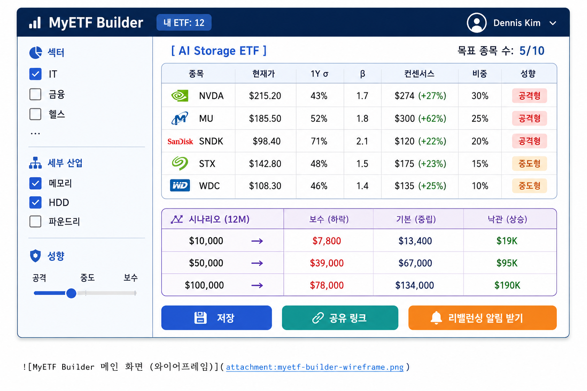

# MyETF Builder — 컨셉 아이디어 문서

> **내가 만드는 미국 주식 ETF 플랫폼**
> 컨셉 아이디어 문서 v1.0

| 항목 | 값 |
|---|---|
| 프로젝트명 | MyETF Builder (가칭) — Custom US-Equity ETF Platform |
| 작성자 | Dennis Kim (김호광) / Cyworld CEO Betalabs Inc. |

| 문서 버전 | v1.0  |  2026-05-10 |
| 문서 분류 | 내부 기획 — 외부 공개용 컨셉 |
| 관련 문서 | `02_MyETF_DevSpec.docx` (개발 스펙), Sample Report (반도체/금융) |

---

## 1. Executive Summary

MyETF Builder는 사용자가 GICS 11개 섹터와 세부 산업 분류에서 직접 종목을 선별해 3-10개 종목으로 구성된 자신만의 'Personal ETF'를 설계하고, AI 기반 펀더멘털·뉴스 요약과 공격형/중도형/보수형 성향 분류, 1년·1개월 변동성 기반의 시나리오 수익 추정($10K / $50K / $100K)을 제공받는 플랫폼이다. 구글 로그인을 통해 개인 포트폴리오를 저장하고, 정기 리밸런싱 알림과 실시간 예상 수익 트래킹을 받을 수 있다.

기존 ETF는 '발행사가 만든 바스켓을 사는' 일방향 상품이지만, MyETF Builder는 '개인이 자신의 투자 신념을 종목 바스켓으로 표현'하도록 한다. 이는 단순한 스크리너를 넘어, 투자 의사결정 워크플로우 자체를 재설계하는 시도다.

### 1.1 한 줄 정의

> "TipRanks급 애널리스트 컨센서스 + Finviz급 섹터 모멘텀 + 변동성 기반 손익 시뮬레이션을 한 화면에서 결합해, 3-10개 종목 ETF를 설계·저장·리밸런싱할 수 있는 솔로 투자자용 도구."

### 1.2 차별화 포인트

| 구분 | 기존 솔루션 | MyETF Builder |
|---|---|---|
| 스크리너 | Finviz / Yahoo: 종목 나열만 | 섹터 → 세부 산업 → 성향 3단 필터 |
| 애널리스트 데이터 | TipRanks: 단일 종목 forecast | 선택한 바스켓 전체의 가중 평균 forecast |
| 수익 시뮬레이션 | 백테스트 위주 / 과거형 | 변동성 기반 향후 12개월 시나리오 (3구간 투자금) |
| 성향 분류 | 주관적 / 부재 | PER · 베타 · 드로다운 기반 자동 라벨링 |
| 저장/리밸런싱 | 엑셀 수기 관리 | 구글 로그인 + 분기/월별 자동 리밸런싱 알림 |
| 가격대 | Bloomberg $24K/년 | 프리티어 인프라 → 무료 ~ $9/월 구독 |

---

## 2. 문제 정의

### 2.1 한국 개인 투자자의 미국주식 의사결정 페인포인트

- **데이터 분산**: TipRanks(컨센서스) / Finviz(섹터) / Yahoo(차트) / 텔레그램(뉴스)을 각각 띄우고 수기 종합
- **변동성 추정 부재**: '얼마 넣으면 얼마 벌까/잃을까'에 대한 정량적 답변 없음. 막연한 기대수익률만 검색
- **성향 매칭 실패**: 30대 투자자가 자신을 공격형이라 믿지만 실제 보유 종목은 보수형 등, 자기 인식과 포트폴리오 불일치
- **리밸런싱 부재**: 1년 후 종목별 비중 왜곡(예: NVDA 비중 25% → 45%)을 인지하지 못한 채 방치
- **ETF의 한계**: SOXX, SMH는 NVDA/TSM/AVGO에 과도 집중. 'AI 스토리지만 노리고 싶다' 같은 thin 슬라이스 표현 불가

### 2.2 시장 기회

Fidelity 2026 섹터 전망에 따르면 통신서비스(AI 트레이드 수혜)가 2025년 최고 성과 섹터로 마감됐고, 2026년에도 'GPU·고대역폭 메모리·데이터센터' 픽앤셔블 테마가 지속될 전망이다. Morningstar는 2026년 Top performer로 SanDisk(+464%), Bloom Energy(+197%), Intel(+197%), Seagate·Western Digital(약 +200%)를 꼽았는데, 이 중 3개가 'AI 스토리지'라는 좁은 카테고리에 속한다. 기존 SOXX 같은 ETF로는 이 좁은 모멘텀을 정확히 노출시킬 수 없다.

> 💡 **인사이트**: '범용 ETF'가 잡지 못하는 thin slice (AI 스토리지, 양자컴퓨팅, GLP-1, Physical AI, Agentic AI 등) 를 개인이 직접 짜 맞출 수 있게 하는 도구는 시장 공백.

---

## 3. 타겟 사용자 & 페르소나

### 3.1 1차 타겟: 적극 운용형 한국 개인 투자자

| 구분 | 내용 |
|---|---|
| 연령/직업 | 30-50대 / 화이트칼라, 자영업, 솔로프리너 |
| 자산 규모 | 주식 운용금 1만 ~ 50만 달러 |
| 월간 활동 | 최소 주 1회 이상 미국주식 종목 검색, 월 1회 이상 매매 |
| 사용 도구 | 키움/미래에셋 HTS + TipRanks + Finviz + 텔레그램 종목방 |
| 언어 | 한국어 우선, 영어 데이터 해석에 능숙 |
| 페인포인트 | 데이터 분산, 의사결정 시 정량적 시나리오 부재, 리밸런싱 누락 |

### 3.2 2차 타겟: 솔로프리너 / Web3·블록체인 종사자

암호화폐로 자산을 일부 보유하면서 '안정적인 미국주식 코어'를 함께 굴리고 싶어 하는 이중 자산군 운용자. Web3Paper 독자층과 강하게 겹치며, 향후 STABLE1 등 스테이블코인 결제 옵션과 자연스러운 연계 가능.

### 3.3 3차 타겟 (확장): 핀플루언서 / 종목방 운영자

자신의 종목 추천을 'My ETF' 형태로 구조화해 구독자에게 공유하는 도구. B2B2C 방향으로 확장 시 핵심 채널.

---

## 4. 핵심 기능 (MVP 범위)

### 4.1 사용자 여정 — 8단계

| 단계 | 사용자 액션 | 시스템 응답 |
|---|---|---|
| 1. 로그인 | Google OAuth 로그인 | 프로필 / 저장된 ETF 로드 |
| 2. 섹터 선택 | GICS 11개 중 1-3개 선택 | 세부 산업 그룹 트리 펼침 |
| 3. 세부 필터 | 예: '정보기술 → 반도체 → 메모리' 또는 '정보기술 → 시스템소프트 → 사이버보안' | 후보 종목 5-30개 노출 |
| 4. 성향 필터 | 공격형 / 중도형 / 보수형 슬라이더 | 변동성 · 베타 · 드로다운으로 자동 필터 |
| 5. 종목 픽 | 후보에서 3-10개 선택 | 각 종목 펀더멘털 카드 + 뉴스 요약 + 컨센서스 박스 |
| 6. 비중 설정 | 균등배분 / 컨센서스 가중 / 수기 입력 | 총합 100% 자동 검증 |
| 7. 시뮬레이션 | 투자금 $10K / $50K / $100K 선택 | 1년 변동성 기반 보수/기본/낙관 3시나리오 손익 |
| 8. 저장 & 트래킹 | ETF 명명, 저장 | 분기 리밸런싱 알림, 실시간 평가손익 트래킹 |

### 4.2 핵심 기능 명세

#### (1) 섹터 & 세부 산업 트리

GICS 11 섹터를 1차 분류로, 24개 산업 그룹과 69개 산업을 2차/3차 분류로 사용. 표준 GICS 코드를 그대로 차용해 데이터 정합성 확보.

#### (2) 종목 카드

- **기본 정보**: 티커, 회사명, 시가총액, 현재가, 52주 레인지, 배당수익률
- **펀더멘털**: PER, PEG, EPS(TTM/Fwd), 매출 성장률, 영업이익률, ROE, 부채비율
- **기술적**: 1M / 3M / 1Y 수익률, 1Y 변동성(연환산 σ), 베타, 최대 드로다운
- **애널리스트 컨센서스**: TipRanks 스타일 — Buy/Hold/Sell 분포, 평균 목표가, Upside %
- **뉴스 요약**: 최근 5건의 헤드라인을 LLM(Claude/GPT)이 3줄 요약 + 감성 라벨
- **성향 라벨**: 공격형 (β>1.3, σ>40%) / 중도형 / 보수형 (β<0.8, σ<20%) 자동 분류

#### (3) 변동성 기반 시나리오 수익 시뮬레이션

사용자가 만든 ETF의 가중 평균 변동성과 가중 평균 컨센서스 목표가를 결합해 12개월 후 시점의 보수/기본/낙관 시나리오 손익을 표시.

| 시나리오 | 전제 | 투자금 $10,000 예시 |
|---|---|---|
| 보수 (-1σ) | 변동성 1표준편차 하락 / 컨센서스 하단 가정 | 예상가치 ≈ $7,800 (-22%) |
| 기본 (Mean) | 컨센서스 평균 목표가 도달 | 예상가치 ≈ $13,200 (+32%) |
| 낙관 (+1σ) | 변동성 1표준편차 상승 / 컨센서스 상단 가정 | 예상가치 ≈ $17,500 (+75%) |

> ⚠️ **주의**: 본 시나리오는 과거 변동성과 애널리스트 컨센서스의 단순 결합이며, 실제 미래 수익률을 보장하지 않음. UI 곳곳에 disclaimer 명시 + 첫 사용 시 동의 절차 필수.

#### (4) Google OAuth 기반 저장

- 한 사용자당 최대 20개 ETF 저장 (무료) / 100개 (유료)
- ETF별 스냅샷 (생성 시점 가격 / 비중) 보존 → 사후 추적용
- 공유 링크 발급 가능 (읽기 전용)

#### (5) 리밸런싱 & 트래킹

- 비중 드리프트 ±5%p 초과 시 알림
- 분기 리밸런싱 권고 리포트 (이메일 발송)
- 실시간 평가손익 = (현재가 × 보유수량) - 진입금액
- 벤치마크 비교: SPY / QQQ / 동일 섹터 ETF 대비 초과수익 표시

---

## 5. GICS 11 섹터 — 세부 산업 & 모멘텀 정리 (2026년 5월 기준)

사용자가 섹터 선택 시 노출될 세부 산업 트리와, 2026년 5월 기준 시장 모멘텀이 강한 thin slice를 함께 정리한다. 모멘텀 정보는 시스템에서 매주 자동 업데이트.

### 5.1 정보기술 (Information Technology)

| 산업 그룹 | 산업 | 대표 종목 | 2026 모멘텀 |
|---|---|---|---|
| 반도체 & 장비 | GPU/AI 가속기 | NVDA, AMD, AVGO | ★★★★★ AI 인프라 핵심 |
| 반도체 & 장비 | 메모리 (DRAM/NAND) | MU, SNDK | ★★★★★ HBM/AI 스토리지 폭증 |
| 반도체 & 장비 | 장비/소재 | ASML, KLAC, AMAT, LRCX | ★★★★ 캐파 증설 |
| 반도체 & 장비 | 파운드리 | TSM, INTC | ★★★★ 미국 본토 캐파 수혜 |
| 반도체 & 장비 | 스토리지 (HDD) | STX, WDC | ★★★★★ AI 데이터센터 HDD 수요 |
| 소프트웨어 | 사이버보안 | CRWD, PANW, ZS, S | ★★★★ 엔터프라이즈 AI 채택 |
| 소프트웨어 | Agentic AI / 인프라 | PLTR, SNOW, MDB | ★★★★ 에이전트 AI 차세대 테마 |
| IT 서비스 | 결제 처리 | V, MA, PYPL | ★★★ 안정 성장 |
| 하드웨어 | 기업용 서버/AI 서버 | DELL, SMCI, HPE | ★★★★ AI 서버 ODM 수혜 |

### 5.2 통신 서비스 (Communication Services)

| 산업 | 대표 종목 | 2026 모멘텀 |
|---|---|---|
| 인터랙티브 미디어 & 서비스 | GOOGL, META | ★★★★ AI 광고/검색 재편 |
| 엔터테인먼트 | NFLX, DIS | ★★★ 광고 모델 안착 |
| 통신사 | T, VZ, TMUS | ★★ 안정 배당주 |

### 5.3 헬스케어 (Health Care)

| 산업 | 대표 종목 | 2026 모멘텀 |
|---|---|---|
| GLP-1 비만치료제 | LLY, NVO | ★★★★★ knock-on 테마 지속 |
| 대형 제약 | JNJ, MRK, PFE, ABBV | ★★★ 안정 배당 |
| 바이오테크 | REGN, VRTX, GILD | ★★★ 파이프라인 차별화 |
| 의료기기 | ISRG, MDT, SYK | ★★★ 로봇수술/AI 진단 |
| 헬스 보험 | UNH, ELV, CI | ★★ 규제 리스크 |

### 5.4 금융 (Financials)

| 산업 | 대표 종목 | 2026 모멘텀 |
|---|---|---|
| 대형 종합은행 | JPM, BAC, WFC, C | ★★★★ 금리 안정 + IB 회복 |
| 투자은행/자산운용 | GS, MS, BLK, KKR, BX | ★★★★ 사모펀드/대체투자 호황 |
| 보험 | BRK.B, PGR, AIG, MET | ★★★ 견조 |
| 거래소/시장 인프라 | ICE, CME, NDAQ, MKTX | ★★★★ 거래량 증가 |
| 핀테크 / 결제 | V, MA, PYPL, SQ | ★★★ 분화 |
| 크립토 / 디지털 자산 | COIN, MSTR, HOOD | ★★★★ 스테이블코인 입법 수혜 |

### 5.5 경기 소비재 (Consumer Discretionary)

| 산업 | 대표 종목 | 2026 모멘텀 |
|---|---|---|
| 전자상거래 | AMZN, MELI, SHOP | ★★★★ AI 쇼핑/광고 |
| 전기차/자동차 | TSLA, GM, F | ★★★ Physical AI / 로보택시 |
| 여행/레저 | BKNG, ABNB, RCL | ★★★ 견조 |
| 럭셔리/리테일 | LVMHF, TJX, HD | ★★ 양극화 |

### 5.6 기타 6개 섹터 요약

| 섹터 | 대표 종목 | 2026 모멘텀 / 주요 테마 |
|---|---|---|
| 산업재 | BA, CAT, GE, RTX, DE, UBER | ★★★★ AI 데이터센터 건설 수혜 (CAT, ETN) |
| 필수 소비재 | PG, KO, PEP, COST, WMT | ★★★ 디펜시브 로테이션 + WMT의 AI 활용 |
| 에너지 | XOM, CVX, COP, OXY, LNG | ★★★ 데이터센터 전력 수요 (LNG/원전) |
| 원자재 | LIN, FCX, NEM, APD | ★★★ 구리/금/우라늄 (전력화 테마) |
| 유틸리티 | NEE, CEG, VST, DUK, SO | ★★★★★ 원전·전력 (AI 데이터센터 핵심) |
| 부동산 | PLD, AMT, EQIX, DLR, WELL | ★★★★ 데이터센터 REITs (EQIX, DLR) |

> 🔥 **2026년 5월 현재 가장 핫한 thin slice 5선**:
> 1. **AI 스토리지** — SNDK, MU, STX, WDC
> 2. **AI 데이터센터 인프라 REIT** — EQIX, DLR, IRM
> 3. **원전·전력** — CEG, VST, NEE
> 4. **Agentic AI** — PLTR, MSFT, GOOGL, NOW
> 5. **Physical AI / 로보택시** — TSLA, NVDA, ISRG

---

## 6. 데이터 소스 매핑

TipRanks 화면을 100% 복제하는 것이 아니라, 'TipRanks급 컨센서스 데이터를 어떻게 합법적으로 조달할 것인가'가 본 프로젝트의 핵심이다. 다음과 같은 다층 데이터 전략을 사용한다.

| 데이터 카테고리 | 1차 소스 | 2차 소스 (백업) | 갱신 주기 |
|---|---|---|---|
| 가격/OHLCV | Yahoo Finance (yfinance) | Alpha Vantage (25/일) | EOD 1일 / 인트라데이 15분 |
| 펀더멘털 | Financial Modeling Prep | Alpha Vantage | 분기 (실적 발표 후 6시간) |
| 애널리스트 컨센서스 | Finnhub (60/분, 무료) | TipRanks 공개 페이지 스크래핑* | 주 1회 |
| 뉴스 헤드라인 | Finnhub News API | Google News RSS | 1시간 |
| 뉴스 요약 | Claude API (Sonnet 4.6) | GPT-4o-mini | 수신 즉시 |
| 섹터 분류 | GICS 정적 매핑 테이블 | S&P 공개 자료 | 분기 |
| 거시 지표 | FRED API | — | 월/일 |

> ⚠️ **스크래핑 주의**: TipRanks·Yahoo의 robots.txt와 ToS를 매월 검토. TipRanks 공식 API (월 $99~) 도입은 사용자 1만 명 도달 후 검토. 초기에는 Finnhub 무료 티어 + 자체 컨센서스 집계(여러 출처 평균) 방식 사용.

---

## 7. 비즈니스 모델

### 7.1 수익 구조

| 티어 | 월 요금 | 주요 기능 | 타겟 |
|---|---|---|---|
| Free | $0 | ETF 3개 저장, 종목 5개 한도, EOD 데이터 | 체험 사용자 |
| Pro | $9 | ETF 20개, 종목 10개 한도, 인트라데이, 리밸런싱 알림 | 1차 타겟 핵심층 |
| Trader | $29 | ETF 100개, 백테스트, API 호출, 우선 지원 | 핀플루언서, 솔로프리너 |
| B2B2C | 협의 | 백색라벨 API, 사용자 화이트라벨 페이지 | 종목방, 자산운용사 |

### 7.2 비수익 모델 (성장 단계)

- **Web3Paper 연계**: 'My ETF of the Week' 코너로 사용자 ETF 큐레이션 → 트래픽 유입
- **스테이블코인 결제 (장기)**: STABLE1 등 자체 스테이블코인 결제 시 5% 할인
- **데이터 라이선스**: 익명화된 사용자 ETF 트렌드 (예: '이번 주 가장 많이 추가된 종목 Top 10')를 미디어/리서치하우스에 라이선스

---

## 8. 위험 & 컴플라이언스

### 8.1 법적 포지셔닝

MyETF Builder는 자본시장법상 '투자자문' 또는 '투자일임'에 해당하지 않도록 설계한다. 구체적으로:

- **특정 종목을 추천하지 않음** — 사용자가 직접 선택. 시스템은 '데이터 표시'만 수행
- **수익률을 '보장'하지 않음** — 모든 시나리오는 '과거 변동성 + 컨센서스 기반 추정'으로 표시
- **주문 실행 기능 없음** — 매매는 사용자가 자신의 증권사 HTS에서 별도 실행
- **한국 자본시장법 제101조의2 '로보어드바이저' 규제 대상도 아님** (자문/일임 기능 부재)

### 8.2 기술/운영 리스크

| 리스크 | 영향도 | 완화 방안 |
|---|---|---|
| 데이터 소스 ToS 변경 (TipRanks, Yahoo) | 높음 | 다층 백업 소스, 공식 API 전환 옵션 |
| 오라클 클라우드 프리티어 한도 초과 | 중간 | Hetzner / DigitalOcean 이전 시나리오 준비 |
| LLM 비용 폭증 (뉴스 요약) | 중간 | 캐싱 + Haiku/mini 모델 활용 + 일일 한도 |
| 변동성 모델 부정확성 | 중간 | EWMA + GARCH 동시 산출, 사용자에 모델 선택권 |
| 시장 폭락기 사용자 불만 | 높음 | disclaimer + 시나리오 3구간 명시, 손실 가능성 강조 |
| 개인정보 (구글 OAuth 토큰) | 높음 | 토큰 암호화 저장, OWASP Top 10 정기 점검 |

---

## 9. 로드맵 (12개월)

| 분기 | 기간 | 마일스톤 | 성공 지표 |
|---|---|---|---|
| Q1 | M1-M3 | MVP — 섹터/종목 선택, 기본 시뮬레이션, 구글 로그인 | 내부 테스터 50명, ETF 200개 생성 |
| Q2 | M4-M6 | 리밸런싱 알림, 뉴스 요약, 결제 (Stripe) | 유료 전환 30명, MAU 1,000명 |
| Q3 | M7-M9 | Web3Paper 연계, 백테스트, 공유 링크 | MAU 5,000명, ARR $5K |
| Q4 | M10-M12 | B2B2C API, 모바일 PWA, 한국 외 영어/중국어 | MAU 20,000명, ARR $30K |

---

## 10. 부록 — 참조 화면 컨셉

### 10.1 메인 빌더 화면 (와이어프레임 텍스트 설명)

# MyETF Builder 메인 화면 (와이어프레임)

> MyETF Builder의 메인 빌더 화면 예시.  
> 섹터 및 산업 선택, 종목 구성, 12개월 시나리오 분석, 저장/공유 기능을 제공합니다.

본 컨셉 문서를 토대로 별도의 '개발 스펙 문서'에서 데이터베이스 설계, API 스펙, 퀀트 산식, 배포 전략을 상세히 정의한다. 샘플 리포트(반도체/금융)는 본 문서의 5장 모멘텀 정리와 10장 화면 컨셉을 실제 데이터로 채운 산출물 예시다.

---

— 문서 끝 —  |  © 2026 Dennis Kim 

